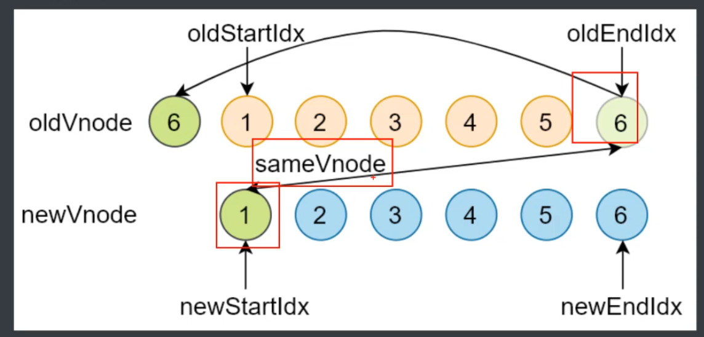

# 模块三 VueJs源码
##  Vue Router，diff算法和虚拟dom
***
### VueRouter
&emsp;官方文档`https://router.vuejs.org/zh/`<br>
&emsp;VueRouter是Vue的路由组件，一个典型的VueRouter配置如下。
```js
import Vue from 'vue'
import VueRouter from 'vue-router'
import Index from '../views/Index.vue'
// 1. 注册路由插件
Vue.use(VueRouter)

// 路由规则
const routes = [
  {
    path: '/',
    name: 'Index',
    component: Index
  },
  {
    path: '/blog',
    name: 'Blog',
    // route level code-splitting
    // this generates a separate chunk (about.[hash].js) for this route
    // which is lazy-loaded when the route is visited.
    component: () => import(/* webpackChunkName: "blog" */ '../views/Blog.vue')
  },
  {
    path: '/photo',
    name: 'Photo',
    // route level code-splitting
    // this generates a separate chunk (about.[hash].js) for this route
    // which is lazy-loaded when the route is visited.
    component: () => import(/* webpackChunkName: "photo" */ '../views/Photo.vue')
  }
]
// 2. 创建 router 对象
const router = new VueRouter({
  routes
})

export default router

```
&emsp;同时在主要函数里我们需要调用这个router，同时，在vue的template中我们也需要把这个东西给写进去
```js
//app.vue
<template>
  <div id="app">
    <div>
      
    </div>
    <div id="nav">
      <!-- 5. 创建链接 -->
      <router-link to="/">Index</router-link> |
      <router-link to="/blog">Blog</router-link> |
      <router-link to="/photo">Photo</router-link>
    </div>
    <!-- 4. 创建路由组建的占位 -->
    <router-view/>
  </div>
</template>

 //main

 new Vue({
  // 3. 注册 router 对象
  router,
  render: h => h(App)
}).$mount('#app')

```
&emsp;Router的用法主要有以下几种<br>
&emsp; ***1.动态路由***<br>
&emsp;动态路由使用占位来动态匹配路径，可以使用懒加载加载动态的组件。可以通过props属性接收传入的值<br>
```js
const routes = [
  {
    path: '/',
    name: 'Index',
    component: Index
  },
  {
    path: '/detail/:id',
    name: 'Detail',
    // 开启 props，会把 URL 中的参数传递给组件
    // 在组件中通过 props 来接收 URL 参数
    props: true,
    // route level code-splitting
    // this generates a separate chunk (about.[hash].js) for this route
    // which is lazy-loaded when the route is visited.
    component: () => import(/* webpackChunkName: "detail" */ '../views/Detail.vue')
  }
]

const router = new VueRouter({
  routes
})
//组件中用法

<template>
  <div>
    <!-- 方式1： 通过当前路由规则，获取数据 -->
    通过当前路由规则获取：{{ $route.params.id }}

    <br>
    <!-- 方式2：路由规则中开启 props 传参 -->
    通过开启 props 获取：{{ id }}
  </div>
</template>

<script>
export default {
  name: 'Detail',
  props: ['id']
}
</script>
```
&emsp; ***2.嵌套路由***<br>
&emsp;嵌套路由常用于嵌套在组件中的会变化的部分,可以使用routerView占位<br>
```js
const routes = [
  {
    name: 'login',
    path: '/login',
    component: Login
  },
  // 嵌套路由
  {
    path: '/',
    component: Layout,
    children: [
      {
        name: 'index',
        path: '',
        component: Index
      },
      {
        name: 'detail',
        path: 'detail/:id',
        props: true,
        component: () => import('@/views/Detail.vue')
      }
    ]
  }
]
```
&emsp; ***3.编程式导航和命名式导航***<br>
在Vue实例内部，你可以通过`$router`访问路由实例。因此你可以调用`this.$router.push`<br>
&emsp;Router有两种模式,都是客户端的实现形式<br>
&emsp; ***1.哈希模式***<br>
&emsp;从表现形式上看，哈希模式带有`#`和参数，例如`http://www.a.com/b/#/a?id=123`，它是基于锚点，以及`onhashchange`事件，<br>
&emsp; ***2.history模式***<br>
&emsp;从表现形式上看，history模式不带有参数，例如`http://www.a.com/b/123`，它是基于html5中的historyApi，即`history.pushState`和`history.replaceState`方法。前者和`push`方法会放松请求，而这个`pushState`方法则会记录历史，但是不会发送请求。然而这些方法只在IE10以上的浏览器使用。这个模式需要服务器的支持，在单页应用中，如果浏览了一个页面，然后刷新后，会发送请求，就会出现404的错误。<br>
#### VueRouter实现原理和模拟
&emsp; ***1.哈希模式***<br>
&emsp;URL#后面的内容作为路径地址，需要监听hashchange事件，根据路径地址找到的对应组件重新渲染<br>
&emsp; ***2.history模式***<br>
&emsp;通过history.pushState()改变地址栏，监听popState事件，然后根据路由地址找到对应组件重新渲染<br>
代码实现
```js
/* eslint-disable */
let _Vue = null;
export default class VueRouter {
  static install(Vue) {
    //1.判断插件是否安装
    //2.记录VUE的构造函数
    //3.将创建vue时传入的router对象挂载到所有vue实例上
    //4.初始化router
    if (VueRouter.install.installed) {
      return;
    }
    VueRouter.install.installed = true;
    _Vue = Vue;
    _Vue.mixin({
      beforeCreate() {
        if (this.$options.router) {
          //只挂router
          _Vue.prototype.$router = this.$options.router;
          this.$options.router.init();
        }
      }
    });
  }
  //将初始化执行的参数放到一个函数中
  init() {
    this.createRouteMap();
    this.initComponents(_Vue);
    this.initEvent();
  }
  //数据的初始化
  constructor(options) {
    this.options = options;
    this.routeMap = {};
    this.data = _Vue.observable({
      current: "/"
    });
    //不同的模式
    this.mode =
      options.mode === "hash" || options.mode === "history"? options.mode : "hash";
  }
  createRouteMap() {
    //遍历所有路由规则然后解析，存到routeMap数据中
    this.options.routes.forEach(route => {
      this.routeMap[route.path] = route.component;
    });
  }

  // 运行时版本vue不会编译temple为render
  // 完整版的会编译template
  // template: '<a :herf="to"><slot></slot></a>'
  initComponents(Vue) {
    Vue.component("router-link", this.routerLinkTemplate(this.mode));

    const self = this;
    Vue.component("router-view", {
      render(h) {
        const component = self.routeMap[self.data.current];
        return h(component);
      }
    });
  }

  initEvent() {
    //使用不同的事件，这个注册事件主要用于浏览器前进后退
    if (this.mode === "history") {
      window.addEventListener("popstate", () => {
        this.data.current = window.location.pathname;
      });
    } else {
      //使用bind来绑定this，这样子效果和上面使用箭头函数this不变一样
      window.addEventListener("load", this.hashChange.bind(this));
      window.addEventListener("hashchange", this.hashChange.bind(this));
    }
  }
  hashChange() {
    if (!window.location.hash) {
      //初始化的时候或者直接在某个标签页刷新
      window.location.hash = "#/";
    }
    this.data.current = window.location.hash.substr(1);
  }
  routerLinkTemplate(mode) {
    return {
      props: {
        to: String
      },
      //使用H函数
      render(h) {
        return h(
          "a",
          {
            attrs: {
              herf: mode === "hash" ? "#" + this.to : this.to
            },
            on: {
              click: this.clickHandler
            }
          },
          [this.$slots.default]
        );
      },
      methods: {
        clickHandler(e) {
          //点击事件
          if (mode === "hash") {
            window.location.hash = "#" + this.to;
          } else {
            history.pushState({}, "", this.to);
          }
          this.$router.data.current = this.to;
          e.preventDefault();
        }
      }
    };
  }
}

```
### Vue响应式原理，差异算法
#### 数据驱动
&emsp; Vue的开发思想是数据驱动式的开发思想，它主要包括了几个主要的模块，分别是数据响应式，双向绑定和数据驱动。<br>
&emsp; ***1.数据响应式***<br>
&emsp; 数据模型仅仅是普通的 JavaScript 对象，而当我们修改数据时，视图会进行更新，避免了繁
琐的 DOM 操作，提高开发效率。<br>
&emsp; ***2.双向绑定***<br
&emsp; 数据改变，视图改变；视图改变，数据也随之改变
我们可以使用 v-model 在表单元素上创建双向数据绑定。<br>
&emsp; ***3.数据驱动***<br>
&emsp; 数据驱动是 Vue 最独特的特性之一
开发过程中仅需要关注数据本身，不需要关心数据是如何渲染到视图。<br>
#### 响应式的核心原理
&emsp; ***1.发布订阅模式***<br>
&emsp;发布订阅模式和观察者模式<br>
&emsp; ***2.观察者模式***<br>
&emsp;发布订阅模式和观察者模式<br>
&emsp; ***3.Vue2.0的数据响应式原理***<br>
&emsp; 根据官方文档的说法`https://cn.vuejs.org/v2/guide/reactivity.html`
>当你把一个普通的 JavaScript 对象传入 Vue 实例作为 data 选项，Vue 将遍历此对象所有的 property，并使用 Object.defineProperty 把这些 property 全部转为 getter/setter。Object.defineProperty 是 ES5 中一个无法 shim(降级处理) 的特性，这也就是 Vue 不支持 IE8 以及更低版本浏览器的原因。
这些 getter/setter 对用户来说是不可见的，但是在内部它们让 Vue 能够追踪依赖，在 property 被访问和修改时通知变更。这里需要注意的是不同浏览器在控制台打印数据对象时对 getter/setter 的格式化并不同，所以建议安装 vue-devtools 来获取对检查数据更加友好的用户界面。
每个组件实例都对应一个 watcher 实例，它会在组件渲染的过程中把“接触”过的数据 property 记录为依赖。之后当依赖项的 setter 触发时，会通知 watcher，从而使它关联的组件重新渲染。


&emsp; 根据官方文档的说法，核心方法就是通过Obj.defineProperty来实现的，由于它的兼容性问题，因此VUE不能支持IE8以下的浏览器。当我们访问数据的时候，我们进行干预操作，通过defineProperty进行数据劫持，从而在每次改变数据的时候，都会调用getter和setter,然后再setter中对数据进行处理，从而更新到dom上。
```html
<!DOCTYPE html>
<html lang="cn">
<head>
  <meta charset="UTF-8">
  <meta name="viewport" content="width=device-width, initial-scale=1.0">
  <meta http-equiv="X-UA-Compatible" content="ie=edge">
  <title>defineProperty</title>
</head>
<body>
  <div id="app">
    hello
  </div>
  <script>
    // 模拟 Vue 中的 data 选项
    let data = {
      msg: 'hello'
    }

    // 模拟 Vue 的实例
    let vm = {}

    // 数据劫持：当访问或者设置 vm 中的成员的时候，做一些干预操作
    Object.defineProperty(vm, 'msg', {
      // 可枚举（可遍历）
      enumerable: true,
      // 可配置（可以使用 delete 删除，可以通过 defineProperty 重新定义）
      configurable: true,
      // 当获取值的时候执行
      get () {
        console.log('get: ', data.msg)
        return data.msg
      },
      // 当设置值的时候执行
      set (newValue) {
        console.log('set: ', newValue)
        if (newValue === data.msg) {
          return
        }
        data.msg = newValue
        // 数据更改，更新 DOM 的值
        document.querySelector('#app').textContent = data.msg
      }
    })

    // 测试
    vm.msg = 'Hello World'
    console.log(vm.msg)
  </script>
</body>
</html>
```
&emsp; ***4.Vue3.0的数据响应式原理***<br>
&emsp;Vue3.0的数据响应式原理主要是通过ES6的proxy来直接监听对象，而不是监听属性,**不需要给每个属性增加getset**，因此不需要循环来监听多个属性，IE不支持。性能由浏览器优化
```js
    // 模拟 Vue 中的 data 选项
    let data = {
      msg: 'hello',
      count: 0
    }

    // 模拟 Vue 实例
    let vm = new Proxy(data, {
      // 执行代理行为的函数
      // 当访问 vm 的成员会执行
      get (target, key) {
        console.log('get, key: ', key, target[key])
        return target[key]
      },
      // 当设置 vm 的成员会执行
      set (target, key, newValue) {
        console.log('set, key: ', key, newValue)
        if (target[key] === newValue) {
          return
        }
        target[key] = newValue
        document.querySelector('#app').textContent = target[key]
      }
    })

    // 测试
    vm.msg = 'Hello World'
    console.log(vm.msg)
```
&emsp; ***5.发布订阅模式和观察者模式***<br>
&emsp;发布/订阅模式(Publish Subscribe Pattern)和观察者模式都是属于设计模式中的行为(Behavioral Patterns)。<br>
<br>
&emsp;在软件架构中，发布/订阅是一种消息范式，**消息的发送者（称为发布者）不会将消息直接发送给特定的接收者（称为订阅者），而是通过消息通道广播出去，让订阅改消息主题的订阅者消费到**。但是观察者模式则是**定义对象间一种一对多的依赖关系，使得每当一个对象改变状态，则所有依赖于它的对象都会得到通知并自动更新**，他们中间没有通过一个中间的消息渠道<br>
<br>
发布/订阅模式最大的特点就是实现了**松耦合**，也就是说你可以让发布者发布消息、订阅者接受消息，而不是寻找一种方式把两个分离的系统连接在一起。当然这种松耦合也是发布/订阅者模式最大的缺点，因为需要中间的代理，**增加了系统的复杂度。而且发布者无法实时知道发布的消息是否被每个订阅者接收到了，增加了系统的不确定性。**<br>
&emsp;发布/订阅者模式与观察者模式是我们经常混淆的两种设计模式，可以说两种设计模式在行为上有一定的相似性，但却是两种不同的设计模式。或者说**发布/订阅者模式是观察者模式的一种变体**。<br>
发布/订阅者模式与观察者模式主要有以下几个不同点：<br>
在观察者模式中，主体维护观察者列表，因此主体知道当状态发生变化时如何通知观察者。然而，在发布者/订阅者中，**发布者和订阅者不需要相互了解。它们只需在中间层消息代理（或消息队列）的帮助下进行通信。**<br>
&emsp;在发布/订阅模式中，组件与观察者模式完全分离。**在观察者模式中，主题和观察者松散耦合。**<br>
&emsp;**观察者模式主要是以同步方式实现的，即当发生某些事件时，主题调用其所有观察者的适当方法。发布服务器/订阅服务器模式主要以异步方式实现（使用消息队列）。**<br>
&emsp;发布者/订阅模式更像是一种跨应用程序模式。发布服务器和订阅服务器可以驻留在两个不同的应用程序中。它们中的每一个都通过消息代理或消息队列进行通信。<br>
在VUE中的例子见[观察者模式](resource/07-观察者模式.html)和发布订阅模式[发布订阅模式](resource/06-发布订阅模式.html)
#### 模拟VUE响应式原理
模拟实现一个最小版本的VUE

&emsp;模拟实现一个最小版本的VUE的目标主要是为了模拟实现VUE的响应式数据的模拟。其中`vue.js`是一个入口。**其中，当我们修改一个响应式数据的值为对象的或者其他的时候，这个数据依然是响应式的。但是如果是在初始化之后给vm.data添加一个值为响应式的，则不可。因为不允许添加根级别响应式数据。可以用vue.set给嵌套对象添加响应式属性**
```js
class Vue {
  constructor(options) {
    //1.通过属性保存选项的数据
    this.$options = options || {};
    this.$data = options.data || {};
    this.$el =typeof options.el === "string" ? document.querySelector(options.el) : options.el;
    //2.将data中的数据通过proxy设置getter和setter，注入到VUE实例中
    this._proxyData(this.$data);
    //3.调用observer对象监控这些数据
    new Observer(this.$data);
    //4. 调用compiler解析指令，表达式等
    new compiler(this)
  }
  _proxyData(data) {
    //遍历所有属性并注入到vue实例中
    //箭头函数不会改变指向，因此用箭头函数
    Object.keys(data).forEach((key) => {
      Object.defineProperty(this, key, {
        enumberable: true,
        configurable: true,
        get() {
          return data[key];
        },
        set(newVal) {
          if (newVal === data[key]) {
            return;
          }
          data[key] = newVal;
        },
      });
    });
  }
}
```
&emsp;oberver的作用是数据劫持和处理，我们要在这里将里面的数据转化为响应式数据
```js
//这个类负责数据劫持
//负责吧data中的属性转换成响应式数据，也会转化data中是对象的属性

//数据变化发送通知
class Observer {
    constructor (data) {
        this.walk(data)
    }
    walk (data) {
        //1.data是否是对象
        if(!data||typeof data !== 'object') {
            return;
        }
        //2.遍历data所有的属性
        Object.keys(data).forEach(key=>{
            this,this.defineReactive(data,key,data[key]);
        })

    }
    defineReactive(obj,key,val) {
        const that = this;
        //收集依赖和发送通知
        let dep = new Dep()
        //将对象内部的数据也转换成响应式数据
        that.walk(val);
        Object.defineProperty(obj,key,{
            enumerable: true,
            configurable: true,
            get() {
                //判断Dep是否有静态成员target
                Dep.target&&dep.addSub(Dep.target);
                return val;
            },
            set(newValue) {
                if(newValue === val) {
                    return;
                }
                that.walk(newValue);
                val = newValue;
                dep.notify();
            }
        })
    }

}
```
&emsp;Compiler的作用是编译模板，负责渲染。操作DOM都在这里，模拟实现的时候没有使用虚拟dom
```js
//负责编译模板，解析指令/插值表达式
//负责页面的首次渲染
//当数据变化后重新渲染视图
class compiler {
  constructor(vm) {
    this.el = vm.$el;
    this.vm = vm;
    this.compile(this.el);
  }
  //编译模板，处理文本节点和元素节点
  compile(el) {
    let childNodes = el.childNodes;
    Array.from(childNodes).forEach((node) => {
      //处理文本节点
      if (this.isTextNode(node)) {
        this.compileText(node);
      }
      //处理元素节点
      else if (this.isElementNode(node)) {
        this.compileElement(node);
      }
      //判断node是否有子节点，确定是否递归调用
      if (node.childNodes && node.childNodes.length) {
        this.compile(node);
      }
    });
  }
  //编译元素节点，处理指令
  compileElement(node) {
      //遍历所有节点
      Array.from(node.attributes).forEach(attr=>{
          //判断是否是指令
          let attrName = attr.name;
          if(this.isDirective(attrName)){
            //v-去除
            attrName = attrName.substr(2);
            let key = attr.value;
            this.update(node,key,attrName);
          }
      })
  }

  //指令特化的函数
  update(node,key,attrName) {
      let updateFn= this[attrName+'Updater'];
      updateFn && updateFn.call(this,node,this.vm[key],key);
  }
  // 处理v-text
  textUpdater(node,value,key) {
    node.textContent = value;
    //添加watcher
    new Watcher (this.vm,key,(newvValue)=>{
        node.textContent = newvValue;
    })
  }

  //v-mode
  modelUpdater(node,value,key) {
      node.value = value;
      //添加watcher
      new Watcher (this.vm,key,(newvValue)=>{
        node.value = newvValue;
    })
    //双向绑定
    node.addEventListener('input',()=>{
        this.vm[key] = node.value;
    })
  }
  //编译文本节点，处理差值表达式
  compileText(node) {
    //正则标表达式获得值，匹配插值表达式
    let reg = /\{\{(.+?)\}\}/;
    let value = node.textContent;
    if (reg.test(value)) {
      let key = RegExp.$1.trim();
      node.textContent = value.replace(reg, this.vm[key]);

      //创建watcher对象，当数据改变更新视图
      new Watcher(this.vm,key,(newvValue)=>{
        node.textContent = newvValue;
      })
    }
  }
  //处理元素属性是否是指令
  isDirective(attrName) {
    return attrName.startsWith("v-");
  }
  //判断节点是否是文本节点
  isTextNode(node) {
    return node.nodeType === 3;
  }
  //判断节点是否是元素节点
  isElementNode(node) {
    return node.nodeType === 1;
  }
}
```
&emsp;Dep类的作用就是收集依赖和添加观察者，可以说它是观察者模式中的发布者。它将在observer和compiler中调用。和watcher有很深的联系。添加时要判断是否有target观察者对象。

```js
//收集依赖，添加观察者
//通知所有观察者
class Dep {
    constructor() {
        this.subs = [];
    }
    //添加观察者
    addSub (sub) {
        if(sub&& sub.update) {
            this.subs.push(sub);
        }
    }
    //发送通知
    notify(){
        this.subs.forEach(sub=>{
            sub.update();
        })
    }
}
```
&emsp;Watcher类就是观察者模式中的观察者,

```js
//数据变化时，dep通知所有watcher实例更新试图
//实例化时往DEP对象中添加自己
class Watcher {
    constructor(vm,key,cb) {
        this.vm = vm;
        //data中的属性
        this.key = key;
        //回调函数用来更新视图
        this.cb = cb;
        //吧watcher对象记录到dep类的静态属性target中
        Dep.target = this;
        //触发get方法，在get方法中调用addsub
        this.oldValue = vm[key];
        Dep.target = null;
    }
    //当数据发生变化时更新视图
    update() {
      let newValue = this.vm[this.key];
      if(this.oldValue === newValue) {
          return;
      }
      this.cb(newValue);  
    }
}

```
&emsp;总体而言这个模拟只是模拟了通过发布订阅模式，使用dep作为收集和发布者，watcher作为观察者，oberver是作数据劫持和处理。
***
### 虚拟DOM的实现原理
#### 虚拟DOM概述
&emsp;Virtual Dom是由普通的JS对象来描述DOM对象。创建虚拟DOM的开销要比真实DOM开销要小。虚拟DOM相比起模板引擎，可以解决跟踪状态变化的问题，它的好处在于状态改变时不需要立刻更新DOM，只需要创建一个虚拟树来描述DOM，然后内部将弄清楚如何有效的更新DOM（diff）。相当于维护程序的状态，跟踪上一次的状态，比较差异然后更新。

&emsp;
#### snabbdom
&emsp;vue2.x使用的虚拟dom就是改造于snabbdom。
&emsp; ***snabbdom核心流程***<br>
* 使用h()函数创建JavaScript 对象（VNode）描述真实DOM
* init()设置模块，创建patch()
* patch()比较新旧两个VNode
* 把变化的内容更新刀真实DOM树上
&emsp;***源码分析***<br>
##### h.ts
&emsp;h函数最早见于hyperscript，使用JavaScript创建超文本，而在snabbdom中则是用于创建VNode。snabbdom使用ts开发，因此它有重载。
```ts
//h函数的定义
//h函数的重载
export function h(sel: string): VNode;
export function h(sel: string, data: VNodeData): VNode;
export function h(sel: string, children: VNodeChildren): VNode;
export function h(sel: string, data: VNodeData, children: VNodeChildren): VNode;
export function h(sel: any, b?: any, c?: any): VNode {
  //处理函数的参数
  var data: VNodeData = {}, children: any, text: any, i: number;
  //三，二，一个参数的情况
  if (c !== undefined) {
    data = b;
    // sel/data/children/txt
    if (is.array(c)) { children = c; }
    else if (is.primitive(c)) { text = c; }
    else if (c && c.sel) { children = [c]; }
  } else if (b !== undefined) {
    if (is.array(b)) { children = b; }
    else if (is.primitive(b)) { text = b; }
    else if (b && b.sel) { children = [b]; }
    else { data = b; }
  }
  if (children !== undefined) {
    for (i = 0; i < children.length; ++i) {
      if (is.primitive(children[i])) children[i] = vnode(undefined, undefined, undefined, children[i], undefined);
    }
  }
  if (
    //如果是svg，要添加命名空间
    sel[0] === 's' && sel[1] === 'v' && sel[2] === 'g' &&
    (sel.length === 3 || sel[3] === '.' || sel[3] === '#')
  ) {
    addNS(data, children, sel);
  }
  //返回VNode
  return vnode(sel, data, children, text, undefined);
};
```
&emsp;Vnode是用来表示DOM节点的，他的结构构如下
```js
export interface VNode {
  //选择器
  sel: string | undefined;
  //节点数据：属性/样式/事件等
  //数据也有定义
  data: VNodeData | undefined;
  //子节点，和text互斥
  children: Array<VNode | string> | undefined;
  //记录对应的真实dom
  elm: Node | undefined;
  //内容，和children互斥
  text: string | undefined;
  //优化
  key: Key | undefined;
}
//VNode的数据
export interface VNodeData {
  props?: Props;
  attrs?: Attrs;
  class?: Classes;
  style?: VNodeStyle;
  dataset?: Dataset;
  on?: On;
  hero?: Hero;
  attachData?: AttachData;
  hook?: Hooks;
  key?: Key;
  ns?: string; // for SVGs
  fn?: () => VNode; // for thunks
  args?: Array<any>; // for thunks
  [key: string]: any; // for any other 3rd party module
}
//最后返回的就是一个对象  return {sel, data, children, text, elm, key};
```
##### snabbdom.ts
&emsp; **VNode渲染成真实DOM(patch)**<br>
整个patch过程,或者说是diff流程，就是在数据修改后能够更新VNode为真实的DOM<br>
<br>
* patch(oldVNode，newVNode)
* 打补丁，将新节点中变化的内容渲染到真实的DOM，最后返回新节点作为下次的旧节点
* 对比新旧VNode是否是相同的节点(节点的key和sel相同)
* 如果不是相同的节点，则删除之前的内容，重新渲染
* 如果是相同的节点，判断VNode中是否有text，如果有并且和oldVNode中的text不同，则直接更新文本内容
* 如果行的VNode有children，判断子节点是否有变化，判断过程使用的是统一层级的对比 
* diff过程只进行同层级的比较
<br>
snabbdom源码<br>
***init函数***<br>
  ```ts
  export function init(modules: Array<Partial<Module>>, domApi?: DOMAPI) {
    let i: number, j: number, cbs = ({} as ModuleHooks);
    //初始化转化虚拟节点的api
    const api: DOMAPI = domApi !== undefined ? domApi : htmlDomApi;
    //吧传入的所有模块的钩子函数，统一存储到cbs对象中,钩子函数在前面有定义
    //吧最终构建的cbs对象的形式cbs={create: []fn1,fn2],update:[]...}
    for (i = 0; i < hooks.length; ++i) {

      cbs[hooks[i]] = [];
      for (j = 0; j < modules.length; ++j) {
        //modules传入的模块数组
        //获取模块中定义的钩子函数
        //hook = module[0].create
        const hook = modules[j][hooks[i]];
        if (hook !== undefined) {
          //获取到的钩子函数全部传进cbs数组中
          (cbs[hooks[i]] as Array<any>).push(hook);
        }
      }
    }
  ```
  **下面的function是一系列的工具函数**
  
  ```ts
    function emptyNodeAt(elm: Element) {
      const id = elm.id ? '#' + elm.id : '';
      const c = elm.className ? '.' + elm.className.split(' ').join('.') : '';
      return vnode(api.tagName(elm).toLowerCase() + id + c, {}, [], undefined, elm);
    }

    function createRmCb(childElm: Node, listeners: number) {
      return function rmCb() {
        if (--listeners === 0) {
          const parent = api.parentNode(childElm);
          api.removeChild(parent, childElm);
        }
      };
    }

    function invokeDestroyHook(vnode: VNode) {
      let i: any, j: number, data = vnode.data;
      if (data !== undefined) {
        if (isDef(i = data.hook) && isDef(i = i.destroy)) i(vnode);
        for (i = 0; i < cbs.destroy.length; ++i) cbs.destroy[i](vnode);
        if (vnode.children !== undefined) {
          for (j = 0; j < vnode.children.length; ++j) {
            i = vnode.children[j];
            if (i != null && typeof i !== "string") {
              invokeDestroyHook(i);
            }
          }
        }
      }
    }
  ```
  &emsp;**init函数中将patch函数范围，作为高阶函数，他大量被调用，但是可以不需要传递参数，并且可以直接访问到外部函数的变量，因为init函数是一个闭包**
  ```ts
  //init内部返回patch函数，把VNode渲染成真实的DOM，并返回VNode，这是一个高阶函数
  return function patch(oldVnode: VNode | Element, vnode: VNode): VNode {
    let i: number, elm: Node, parent: Node;
    //保存新插入节点的队列，为了触发钩子函数
    const insertedVnodeQueue: VNodeQueue = [];
    //执行模块的pre函数
    for (i = 0; i < cbs.pre.length; ++i) cbs.pre[i]();
    //如果oldVNode不是VNode，则创建VNode并设置elm
    if (!isVnode(oldVnode)) {
      //DOM元素转化成空VNode
      oldVnode = emptyNodeAt(oldVnode);
    }
    //判断是否是同一节点
    if (sameVnode(oldVnode, vnode)) {
      //寻找差一并更新
      patchVnode(oldVnode, vnode, insertedVnodeQueue);
    } else {
      //如果新旧不同，则VNode创建对应的Dom
      //获取当前的DOM元素
      elm = oldVnode.elm as Node;
      parent = api.parentNode(elm);
      //创建对应的DOM元素，触发init/create钩子函数
      createElm(vnode, insertedVnodeQueue);

      if (parent !== null) {
        //如果父节点不为空，把VNode对应的DOM插入到文档中
        api.insertBefore(parent, vnode.elm as Node, api.nextSibling(elm));
        //移除老节点
        removeVnodes(parent, [oldVnode], 0, 0);
      }
    }
    //执行用户设置的insert钩子函数
    for (i = 0; i < insertedVnodeQueue.length; ++i) {
      (((insertedVnodeQueue[i].data as VNodeData).hook as Hooks).insert as any)(insertedVnodeQueue[i]);
    }
    // 执行模块的post钩子函数
    for (i = 0; i < cbs.post.length; ++i) cbs.post[i]();
    //返回VNode
    return vnode;
  };
  }
  //initEnd
  ```
  &emsp;**patch函数中调用了几个比较复杂的工具函数，这里提取出来**<br>
  &emsp;**createElm**
  <br>
  ```ts
  function createElm(vnode: VNode, insertedVnodeQueue: VNodeQueue): Node {
      let i: any, data = vnode.data;
      if (data !== undefined) {
        //执行用户传入的init钩子函数
        if (isDef(i = data.hook) && isDef(i = i.init)) {
          i(vnode);
          data = vnode.data;
        }
      }
      //将VNode转换成真实的DOM对象（没有渲染）
      let children = vnode.children, sel = vnode.sel;
      if (sel === '!') {
        //创建注释节点
        if (isUndef(vnode.text)) {
          vnode.text = '';
        }
        vnode.elm = api.createComment(vnode.text as string);
      } else if (sel !== undefined) {
        // Parse selector
        //解析选择器
        const hashIdx = sel.indexOf('#');
        const dotIdx = sel.indexOf('.', hashIdx);
        const hash = hashIdx > 0 ? hashIdx : sel.length;
        const dot = dotIdx > 0 ? dotIdx : sel.length;
        const tag = hashIdx !== -1 || dotIdx !== -1 ? sel.slice(0, Math.min(hash, dot)) : sel;
        const elm = vnode.elm = isDef(data) && isDef(i = (data as VNodeData).ns) ? api.createElementNS(i, tag): api.createElement(tag);
        if (hash < dot) elm.setAttribute('id', sel.slice(hash + 1, dot));
        if (dotIdx > 0) elm.setAttribute('class', sel.slice(dot + 1).replace(/\./g, ' '));
        //执行模块的create钩子函数
        for (i = 0; i < cbs.create.length; ++i) cbs.create[i](emptyNode, vnode);
        //如果有子节点，则创建对应的DOM
        if (is.array(children)) {
          for (i = 0; i < children.length; ++i) {
            const ch = children[i];
            if (ch != null) {
              api.appendChild(elm, createElm(ch as VNode, insertedVnodeQueue));
            }
          }
        } else if (is.primitive(vnode.text)) {
          //文本节点处理
          api.appendChild(elm, api.createTextNode(vnode.text));
        }
        i = (vnode.data as VNodeData).hook; // Reuse variable
        if (isDef(i)) {
          //执行用户传入的钩子函数create
          if (i.create) i.create(emptyNode, vnode);
          if (i.insert) insertedVnodeQueue.push(vnode);
        }
      } else {
        vnode.elm = api.createTextNode(vnode.text as string);
      }
      return vnode.elm;
    }
  ```
  &emsp;**addVNodes和removeVNodes**<br>
  ```ts
      function addVnodes(parentElm: Node,
                      before: Node | null,
                      vnodes: Array<VNode>,
                      startIdx: number,
                      endIdx: number,
                      insertedVnodeQueue: VNodeQueue) {
      for (; startIdx <= endIdx; ++startIdx) {
        const ch = vnodes[startIdx];
        if (ch != null) {
          api.insertBefore(parentElm, createElm(ch, insertedVnodeQueue), before);
        }
      }
    }

    function removeVnodes(parentElm: Node,
                          vnodes: Array<VNode>,
                          startIdx: number,
                          endIdx: number): void {
      for (; startIdx <= endIdx; ++startIdx) {
        let i: any, listeners: number, rm: () => void, ch = vnodes[startIdx];
        if (ch != null) {
          //sel是否有
          if (isDef(ch.sel)) {
            //执行destroy钩子函数（子节点的也会执行）
            invokeDestroyHook(ch);
            listeners = cbs.remove.length + 1;
            //创建删除的回调函数
            rm = createRmCb(ch.elm as Node, listeners);
            for (i = 0; i < cbs.remove.length; ++i) cbs.remove[i](ch, rm);
            if (isDef(i = ch.data) && isDef(i = i.hook) && isDef(i = i.remove)) {
              i(ch, rm);
            } else {
              rm();
            }
          } else { // Text node
            api.removeChild(parentElm, ch.elm as Node);
          }
        }
      }
    }
  ```
  &emsp;**PatchVnode函数**<br>
  <br>
  ```ts
    function patchVnode(oldVnode: VNode, vnode: VNode, insertedVnodeQueue: VNodeQueue) {
        let i: any, hook: any;
        //首先先执行用户设置的prepatch钩子函数
        if (isDef(i = vnode.data) && isDef(hook = i.hook) && isDef(i = hook.prepatch)) {
          i(oldVnode, vnode);
        }
        const elm = vnode.elm = (oldVnode.elm as Node);
        let oldCh = oldVnode.children;
        let ch = vnode.children;
        //如果新旧节点相同直接返回
        if (oldVnode === vnode) return;
        if (vnode.data !== undefined) {
          //执行模块中的update钩子函数
          for (i = 0; i < cbs.update.length; ++i) cbs.update[i](oldVnode, vnode);
          i = vnode.data.hook;
          //执行用户的
          if (isDef(i) && isDef(i = i.update)) i(oldVnode, vnode);
        }
        //如果是没有定义vnode.text
        if (isUndef(vnode.text)) {
          if (isDef(oldCh) && isDef(ch)) {
            //使用diff算法对比子节点，更新自己诶但
            if (oldCh !== ch) updateChildren(elm, oldCh as Array<VNode>, ch as Array<VNode>, insertedVnodeQueue);
          } else if (isDef(ch)) {
            //如果新节点有children，老节点咩有
            //批量添加
            if (isDef(oldVnode.text)) api.setTextContent(elm, '');
            addVnodes(elm, null, ch as Array<VNode>, 0, (ch as Array<VNode>).length - 1, insertedVnodeQueue);
          } else if (isDef(oldCh)) {
            //如果老节点有children，新节点咩有
            //批量移除
            removeVnodes(elm, oldCh as Array<VNode>, 0, (oldCh as Array<VNode>).length - 1);
          } else if (isDef(oldVnode.text)) {
            //清空
            api.setTextContent(elm, '');
          }
        } else if (oldVnode.text !== vnode.text) {
          //这是有定义text，则更新文本
          //移除老节点
          if (isDef(oldCh)) {
            removeVnodes(elm, oldCh as Array<VNode>, 0, (oldCh as Array<VNode>).length - 1);
          }
          api.setTextContent(elm, vnode.text as string);
        }
        if (isDef(hook) && isDef(i = hook.postpatch)) {
          i(oldVnode, vnode);
        }
      }
  ```
&emsp;**UpdateChildren函数**<br>
&emsp;UpdateChildren函数是diff算法的核心，它会对比新旧节点的children，然后更新DOM
**要对比两棵树的差异，我们可以将两个树的每一个节点比较，但是这样的时间复杂度为O(n^3)DOM操作中我们很少讲父节点更新到一个子节点，因此我们一般找同一个级别的子节点进行比较，然后再找下一级别的节点进行比较，这样的算法的时间复杂度为O(n)**<br>
&emsp;在进行同级别的比较的时候，首先对新老节点的数组的开始和结束节点设置标记索引，遍历的过程移动索引，在对 ***开始和结束节点*** 进行对比的时候，总共有四种情况：<br>
  1. oldStartVNode/newStartVnode(旧开始节点/新开始节点)
  2. oldEndVNode/newEndtVnode(旧结束节点/新结束节点)
  3. oldStartVNode/newEndVnode(旧开始节点/新结束节点)
  4. oldEndVNode/newStartVnode(旧结束节点/新开始节点)
<br>
&emsp;  开始节点和结束节点相互比较这两种情况比较类似
  1. oldStartVNode/newStartVnode(旧开始节点/新开始节点)
  2. oldEndVNode/newEndtVnode(旧结束节点/新结束节点)
<br>
&emsp;对比新旧开始节点，如果他们二者是sameVNode，即key和sel相同则会做两件事<br>
  * 调用patchVNode()对比和更新节点
  * 把索引往下一步移动
否则则会开始比较新结束节点和旧结束节点。<br>
&emsp;对比旧开始节点/新结束节点（oldStartVNode/newEndVnode），如果是相同的，则<br>
  * 调用patchVNode()对比和更新节点
  * 把oldStartNode对应的Dom元素移动到右边
  * 更新索引
<br>
&emsp;对比旧结束节点/新开始节点（oldEndVNode/newStartVnode），如果是相同的，则<br>
  * 调用patchVNode()对比和更新节点
  * 把oldEndNode对应的Dom元素移动到左边
  * 更新索引
<br>
&emsp;如果不是以上四种情况，则遍历新节点，使用newStartNode的key在老节点数组中寻找相同的节点，如果没有找到，说明newStartNode是新节点，我们就要创建对应的DOM元素并且插入到DOM树中，如果找到了，则判断和老节点的sel选择器是否相同，如果不相同，则说明节点被修改了，也是新节点，要重新创建，如果相同的话，则把它移动到左边<br>
<br>
&emsp;任意一个节点的子节点先遍历完，则循环结束，如果老节点的数组先遍历完，则说明新节点有剩余，把剩余的节点都需要新增，我们将它插入到数组的尾部<br>
按照顺序从头遍历到尾对比开始节点，如果相同则开始节移动index，当遇到第一个不同，则停止移动开始节点的index，然后从结束节点开始对比，如果相同则往前，直到对比出不同才停止移动
<br>
&emsp;如果新节点先遍历完，则说明老节点有剩余，则把多余的删除。思路和插入相同，只是移动的index从老节点换成新节点。
<br>
```ts
  function updateChildren(parentElm: Node,
                            oldCh: Array<VNode>,
                            newCh: Array<VNode>,
                            insertedVnodeQueue: VNodeQueue) {
      let oldStartIdx = 0, newStartIdx = 0;
      let oldEndIdx = oldCh.length - 1;
      let oldStartVnode = oldCh[0];
      let oldEndVnode = oldCh[oldEndIdx];
      let newEndIdx = newCh.length - 1;
      let newStartVnode = newCh[0];
      let newEndVnode = newCh[newEndIdx];
      let oldKeyToIdx: any;
      let idxInOld: number;
      let elmToMove: VNode;
      let before: any;

      while (oldStartIdx <= oldEndIdx && newStartIdx <= newEndIdx) {
        //索引变化后没可能会把节点设置为空
        if (oldStartVnode == null) {
          //如果为空，则移动
          oldStartVnode = oldCh[++oldStartIdx]; // Vnode might have been moved left
        } else if (oldEndVnode == null) {
          oldEndVnode = oldCh[--oldEndIdx];
        } else if (newStartVnode == null) {
          newStartVnode = newCh[++newStartIdx];
        } else if (newEndVnode == null) {
          newEndVnode = newCh[--newEndIdx];
          //比较开始和结束节点的四种情况
        } else if (sameVnode(oldStartVnode, newStartVnode)) {
          //比较老开始节点和新开始节点
          patchVnode(oldStartVnode, newStartVnode, insertedVnodeQueue);
          oldStartVnode = oldCh[++oldStartIdx];
          newStartVnode = newCh[++newStartIdx];
        } else if (sameVnode(oldEndVnode, newEndVnode)) {
          //比较老结束节点和新结束节点
          patchVnode(oldEndVnode, newEndVnode, insertedVnodeQueue);
          oldEndVnode = oldCh[--oldEndIdx];
          newEndVnode = newCh[--newEndIdx];
        } else if (sameVnode(oldStartVnode, newEndVnode)) { // Vnode moved right
          //比较老开始节点和新结束节点
          patchVnode(oldStartVnode, newEndVnode, insertedVnodeQueue);
          api.insertBefore(parentElm, oldStartVnode.elm as Node, api.nextSibling(oldEndVnode.elm as Node));
          oldStartVnode = oldCh[++oldStartIdx];
          newEndVnode = newCh[--newEndIdx];
        } else if (sameVnode(oldEndVnode, newStartVnode)) { // Vnode moved left
          //比较老结束节点和新的开始节点
          patchVnode(oldEndVnode, newStartVnode, insertedVnodeQueue);
          api.insertBefore(parentElm, oldEndVnode.elm as Node, oldStartVnode.elm as Node);
          oldEndVnode = oldCh[--oldEndIdx];
          newStartVnode = newCh[++newStartIdx];
        } else {
          //不符合四种情况
          //使用newstart的key去老数组中寻找
          //先设置KEY和index的对象
          if (oldKeyToIdx === undefined) {
            oldKeyToIdx = createKeyToOldIdx(oldCh, oldStartIdx, oldEndIdx);
          }
          //遍历newstartVnode,从来节点中找相同key
          idxInOld = oldKeyToIdx[newStartVnode.key as string];
          //如果是新的节点
          if (isUndef(idxInOld)) { // New element
          //没找到，则创建元素
            api.insertBefore(parentElm, createElm(newStartVnode, insertedVnodeQueue), oldStartVnode.elm as Node);
            newStartVnode = newCh[++newStartIdx];
          } else {
            //先找到这个老节点
            elmToMove = oldCh[idxInOld];
            //对比sel，看是否被修改，修改则新建
            if (elmToMove.sel !== newStartVnode.sel) {
              api.insertBefore(parentElm, createElm(newStartVnode, insertedVnodeQueue), oldStartVnode.elm as Node);
            } else {
              //如果相同，patchVNode（）
              patchVnode(elmToMove, newStartVnode, insertedVnodeQueue);
              oldCh[idxInOld] = undefined as any;
              api.insertBefore(parentElm, (elmToMove.elm as Node), oldStartVnode.elm as Node);
            }
            //重新赋值，取得下一个节点
            newStartVnode = newCh[++newStartIdx];
          }
        }
      }
      //循环结束之后，收尾，删除或者插入节点
      if (oldStartIdx <= oldEndIdx || newStartIdx <= newEndIdx) {
        if (oldStartIdx > oldEndIdx) {
          before = newCh[newEndIdx+1] == null ? null : newCh[newEndIdx+1].elm;
          addVnodes(parentElm, before, newCh, newStartIdx, newEndIdx, insertedVnodeQueue);
        } else {
          removeVnodes(parentElm, oldCh, oldStartIdx, oldEndIdx);
        }
      }
    }
```
#### 模块源码
&emsp;patch()->patchVnode()->updateChildren()<br>
&emsp;snabbdom为了保证核心库的精简，吧处理元素的属性事件样式等工作放置到模块中<br>
&emsp;模块可以按照需要导入<br>
&emsp;可以查看官方文档<br>
&emsp;核心的HOOKs钩子函数<br>
&emsp;**Snabbdom 提供的所有模块在：src/modules 文件夹下，主要模块有：** <br>
* attributes.ts
  * 使用 setAttribute/removeAttribute 操作属性
  * 能够处理 boolean 类型的属性
* class.ts
  * 切换类样式
* dataset.ts
  * 操作元素的 data-* 属性
  * eventlisteners.ts
  * 注册和移除事件
* module.ts
  * 定义模块遵守的钩子函数
* props.ts
  * 和 attributes.ts 类似，但是是使用 elm[attrName] = value 的方式操作属性
* style.ts
  * 操作行内样式
  * 可以使动画更平滑
* hero.ts
  * 自定义的模块，examples/hero 示例中使用


