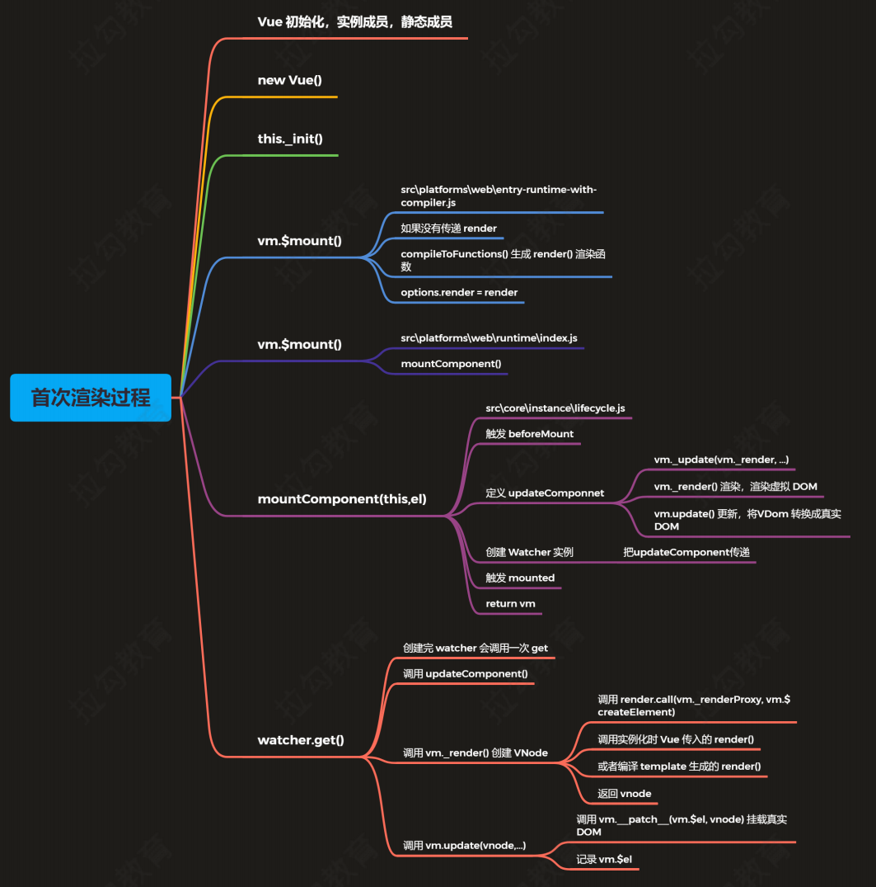
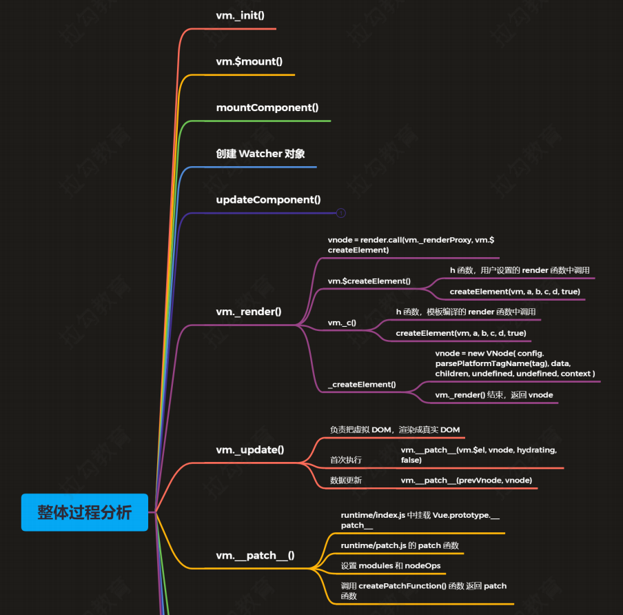
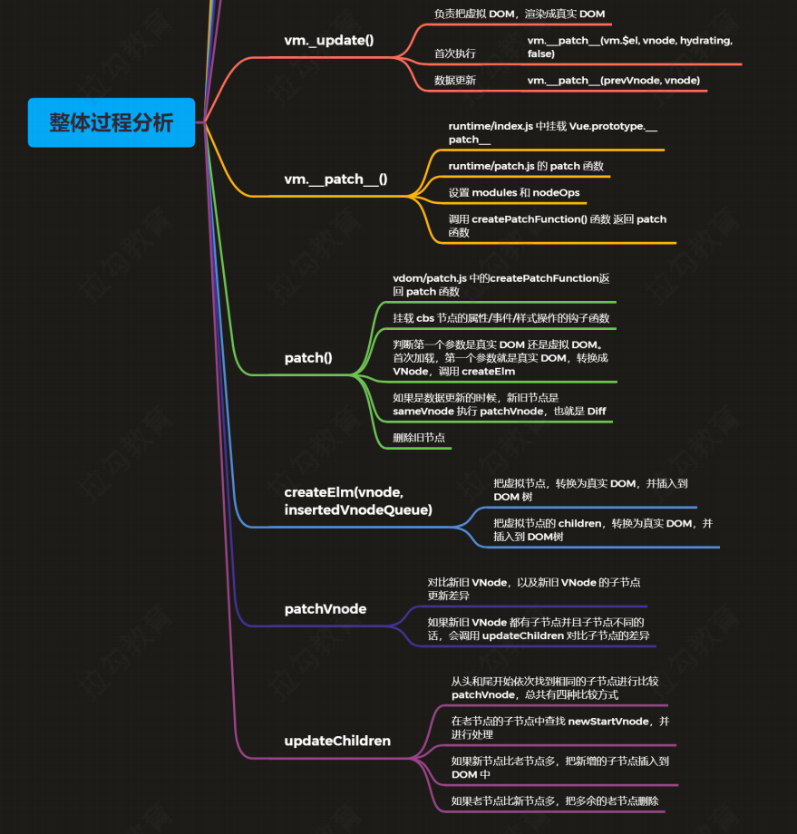
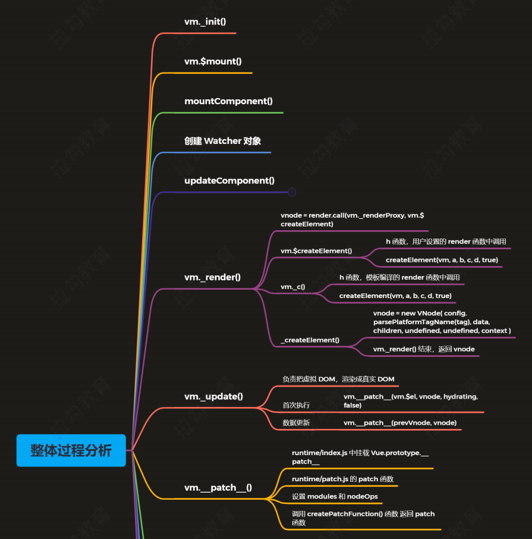
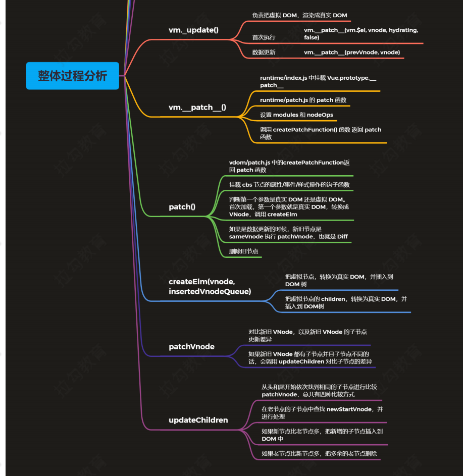

### Vue响应式源码和初始化源码
1. 初始化vue的el不能是body或者html
2. 如果没有render，则会将template转化为render函数，如果设置了render，不管怎么样都会调用mount方法挂载DOM
3. $mount方法是在init方法中调用<br>
`\src\platforms\web\entry-runtime-with-compiler.js`主要编译template为render
4. Vue初始化->创建静态和实例成员的过程
5. watcher分为三种，computedWatcher计算属性，用户watcher（侦听器），渲染watcher，前两个都是在initstate的时候创建的，渲染watcher则是在lifecycle里面创建的
6. 在初始化数据的时候，调用observer函数，如果咩有响应式处理，则进行，然后对数组和对象的响应式处理，数组的话则要定义修补的数组操作函数，对象的话则walk遍历。对每一个属性调用definReactive.主要就是定义getter和setter，getter收集，setternotify。
7. dep的sub数组
8. notify会调用queueWatcher，然后最后会调用watcher。run更新数据。然后清理依赖然后出发actived钩子函数和updated钩子函数
9. $delete不能是vue实例或者vue实例的根数据对象
10. Vue首次渲染整体过程

&emsp;***1.对VUE进行初始化，初始化里面的静态成员和实例成员，其中静态成员主要在`initGlobalApi`这个函数中进行初始化，初始化的对象包括：&emsp;vue.config设置，vue.set,vue.delete,vue.nexttick，vue.options等方法，也初始化了inituse,initmixin,initextend,initassetregisters等方法***<br>
```js
  //注册组件
  initUse(Vue)
  //注册mixin函数
  initMixin(Vue)
  //注册extends函数，实现通过options返回组件的构造函数
  initExtend(Vue)
  //注册Vue。directive，vue。filter，vue.component
  initAssetRegisters(Vue)
```
&emsp;***2.调用newVue函数，初始化Vue，这里的vue使用的是函数定义，原因是整个初始化过程中，我们会使用mixin方法来初始化init方法，而这个方法在代码中调用的的是initMixin方法***<br>
```js
//src\core\instance\index.js
//注册vm的init方法，初始化vm
initMixin(Vue)
//注册vm的$data,$watch,$delete,$props,$set
stateMixin(Vue)
//初始化事件的用法
//$on,$once,$off等
eventsMixin(Vue)
//初始化生命周期的相关方法
//$destory,
lifecycleMixin(Vue)
//混入render
//$nexttick,/_render
renderMixin(Vue)
```
&emsp;***3.this.init函数,调用这个函数的时候，我们主要做的事情有几件，一是合并options，把配置进行合并，二是进行一些初始化，初始化生命周期相关的函数，初始化vm的事件监听，这这里是绑定在当前组件上的事件，三是初始化vm编译的render，接下来会调用钩子函数，beforcreate，接下来就是初始化inject成员，初始化prop，method，data，computed，watch，然后初始化provide，最后电泳created钩子函数。初始化完成之后，会调用vm.$mount进行挂载***<br>
```js
export function initMixin (Vue: Class<Component>) {
  Vue.prototype._init = function (options?: Object) {
    const vm: Component = this
    // a uid
    vm._uid = uid++

    let startTag, endTag
    /* istanbul ignore if */
    if (process.env.NODE_ENV !== 'production' && config.performance && mark) {
      startTag = `vue-perf-start:${vm._uid}`
      endTag = `vue-perf-end:${vm._uid}`
      mark(startTag)
    }

    // a flag to avoid this being observed
    //vue实例不被监听
    vm._isVue = true
    // merge options
    //合并options
    if (options && options._isComponent) {
      // optimize internal component instantiation
      // since dynamic options merging is pretty slow, and none of the
      // internal component options needs special treatment.
      initInternalComponent(vm, options)
    } else {
      vm.$options = mergeOptions(
        resolveConstructorOptions(vm.constructor),
        options || {},
        vm
      )
    }
    /* istanbul ignore else */
    if (process.env.NODE_ENV !== 'production') {
      initProxy(vm)
    } else {
      vm._renderProxy = vm
    }
    // expose real self
    vm._self = vm
    //vm生命周期相关变量的初始化
    //$children $parent $root $refs
    initLifecycle(vm)
    //vm的事件监听初始化，父组件绑定在当前组件上的事件
    initEvents(vm)
    //vm的编译render初始化
    //$slots $scopedSlots _c $createElemnt $attrs $listeners
    initRender(vm)
    //beforeCreate 钩子回调函数
    callHook(vm, 'beforeCreate')
    //吧inject的成员注入到vm上
    initInjections(vm) // resolve injections before data/props
    //初始化vm的_props/methods/_data/computed/watch
    initState(vm)
    //初始化provide
    initProvide(vm) // resolve provide after data/props
    //created钩子函数的回调
    callHook(vm, 'created')

    /* istanbul ignore if */
    if (process.env.NODE_ENV !== 'production' && config.performance && mark) {
      vm._name = formatComponentName(vm, false)
      mark(endTag)
      measure(`vue ${vm._name} init`, startTag, endTag)
    }
    //调用$mount挂载
    if (vm.$options.el) {
      vm.$mount(vm.$options.el)
    }
  }
}
```
&emsp;***4.调用`vm.$mount`函数，这里调用的是`src\platforms\web\entry-runtime-with-compiler.js`里的mount函数，当我们没有传入render的时候，会吧模板编译成render函数，，它通过`compileToFunctions`函数来编译，编译好之后，他会将render保存到options.render***<br>
```js
Vue.prototype.$mount = function (
  el?: string | Element,
  hydrating?: boolean
): Component {
  //获取el对象
  el = el && query(el)

  /* istanbul ignore if */
  //el不能是body或者html
  if (el === document.body || el === document.documentElement) {
    process.env.NODE_ENV !== 'production' && warn(
      `Do not mount Vue to <html> or <body> - mount to normal elements instead.`
    )
    return this
  }

  const options = this.$options
  // resolve template/el and convert to render function
  //将template转化为render
  if (!options.render) {
    let template = options.template
    if (template) {
      if (typeof template === 'string') {
        if (template.charAt(0) === '#') {
          template = idToTemplate(template)
          /* istanbul ignore if */
          if (process.env.NODE_ENV !== 'production' && !template) {
            warn(
              `Template element not found or is empty: ${options.template}`,
              this
            )
          }
        }
      } else if (template.nodeType) {
        template = template.innerHTML
      } else {
        if (process.env.NODE_ENV !== 'production') {
          warn('invalid template option:' + template, this)
        }
        return this
      }
    } else if (el) {
      template = getOuterHTML(el)
    }
    if (template) {
      /* istanbul ignore if */
      if (process.env.NODE_ENV !== 'production' && config.performance && mark) {
        mark('compile')
      }

      const { render, staticRenderFns } = compileToFunctions(template, {
        outputSourceRange: process.env.NODE_ENV !== 'production',
        shouldDecodeNewlines,
        shouldDecodeNewlinesForHref,
        delimiters: options.delimiters,
        comments: options.comments
      }, this)
      options.render = render
      options.staticRenderFns = staticRenderFns

      /* istanbul ignore if */
      if (process.env.NODE_ENV !== 'production' && config.performance && mark) {
        mark('compile end')
        measure(`vue ${this._name} compile`, 'compile', 'compile end')
      }
    }
  }
  //调用mount方法渲染DOM
  //如果有render方法，就会直接调用mount
  return mount.call(this, el, hydrating)
}
```
&emsp;***5.调用`vm.$mount`函数，这里的mount函数是`src\platforms\web\runtime\index.js`,这个方法中我们会重新获取el，然后再调用`mountComponent`函数***<br>
```js
// public mount method
Vue.prototype.$mount = function (
  el?: string | Element,
  hydrating?: boolean
): Component {
  el = el && inBrowser ? query(el) : undefined
  return mountComponent(this, el, hydrating)
}
```
&emsp;***6.mountComponent，这个函数的位置是`src\core\instance\lifecycle.js`,他的逻辑是这样子的，首先，他会判断是否有render选项和模板，在开发环境中不会编译为render函数，因此会提示，然后会触发一个钩子函数，beforemount，接下来，我们会定义一个`updateComponent`函数，这个函数中，会调用render和update方法，render方法是生成虚拟dom然后update方法是用来将虚拟DOM渲染为真实DOM，然后我们会创建`watcher`并且将这个函数传给watcher，接下来会调用watcher的get方法，最后我们会触发mounted，接下来，就是返回vm***<br>
```js
export function mountComponent (
  vm: Component,
  el: ?Element,
  hydrating?: boolean
): Component {
  vm.$el = el
  if (!vm.$options.render) {
    vm.$options.render = createEmptyVNode
    if (process.env.NODE_ENV !== 'production') {
      /* istanbul ignore if */
      if ((vm.$options.template && vm.$options.template.charAt(0) !== '#') ||
        vm.$options.el || el) {
        warn(
          'You are using the runtime-only build of Vue where the template ' +
          'compiler is not available. Either pre-compile the templates into ' +
          'render functions, or use the compiler-included build.',
          vm
        )
      } else {
        warn(
          'Failed to mount component: template or render function not defined.',
          vm
        )
      }
    }
  }
  callHook(vm, 'beforeMount')

  let updateComponent
  /* istanbul ignore if */
  if (process.env.NODE_ENV !== 'production' && config.performance && mark) {
    updateComponent = () => {
      const name = vm._name
      const id = vm._uid
      const startTag = `vue-perf-start:${id}`
      const endTag = `vue-perf-end:${id}`
      //标记
      mark(startTag)
      //调用render函数渲染，渲染虚拟dom
      const vnode = vm._render()
      mark(endTag)
      measure(`vue ${name} render`, startTag, endTag)

      mark(startTag)
      //更新，将虚拟dom转化为真实DOM
      vm._update(vnode, hydrating)
      mark(endTag)
      measure(`vue ${name} patch`, startTag, endTag)
    }
  } else {
    updateComponent = () => {
      vm._update(vm._render(), hydrating)
    }
  }

  // we set this to vm._watcher inside the watcher's constructor
  // since the watcher's initial patch may call $forceUpdate (e.g. inside child
  // component's mounted hook), which relies on vm._watcher being already defined
  new Watcher(vm, updateComponent, noop, {
    before () {
      if (vm._isMounted && !vm._isDestroyed) {
        //调用beforeupdate
        callHook(vm, 'beforeUpdate')
      }
    }
  }, true /* isRenderWatcher */)
  hydrating = false

  // manually mounted instance, call mounted on self
  // mounted is called for render-created child components in its inserted hook
  if (vm.$vnode == null) {
    vm._isMounted = true
    callHook(vm, 'mounted')
  }
  return vm
}
```

&emsp;***6.watcher()方法,这个方法是在watcher创建完就会调用的，然后我们就会调用传入的updateComponent，我们会调用`vm._update(vm._render(), hydrating)`这个方法来执行render函数和update函数，render函数中，我们会调用vue传入的render，或者调用template转化来的render，然后返回VNode，而update函数则会调用`vm.__patch_(vm.$el.vnode)`挂载真实DOM，然后会记录`vm.$el`***<br>
```js
get () {
    pushTarget(this)
    let value
    const vm = this.vm
    try {
      value = this.getter.call(vm, vm)
    } catch (e) {
      if (this.user) {
        handleError(e, vm, `getter for watcher "${this.expression}"`)
      } else {
        throw e
      }
    } finally {
      // "touch" every property so they are all tracked as
      // dependencies for deep watching
      if (this.deep) {
        traverse(value)
      }
      popTarget()
      this.cleanupDeps()
    }
    return value
  }
```
***
#### 数据的响应式


&emsp;***1.vm._init()函数***<br>
&emsp;***2.`vm.$mount`函数***<br>
&emsp;***3.mountComponent函数***<br>
&emsp;***4.创建watcher对象***<br>
&emsp;***5.updateComponent***<br>
&emsp;***6.vm._render***<br>
&emsp;***7.vm._update***<br>
&emsp;***6.vm._patch_()***<br>
&emsp;***5.patch***<br>
&emsp;***6.createElm***<br>
### Vue虚拟DOM


&emsp;***1.调用newVue函数***<br>
&emsp;***2.this.init函数***<br>
&emsp;***3.调用`vm.$mount`函数***<br>
&emsp;***4.调用`vm.$mount`函数***<br>
&emsp;***5.mountComponent***<br>
&emsp;***6.watcher***<br>
### Vue模板编译