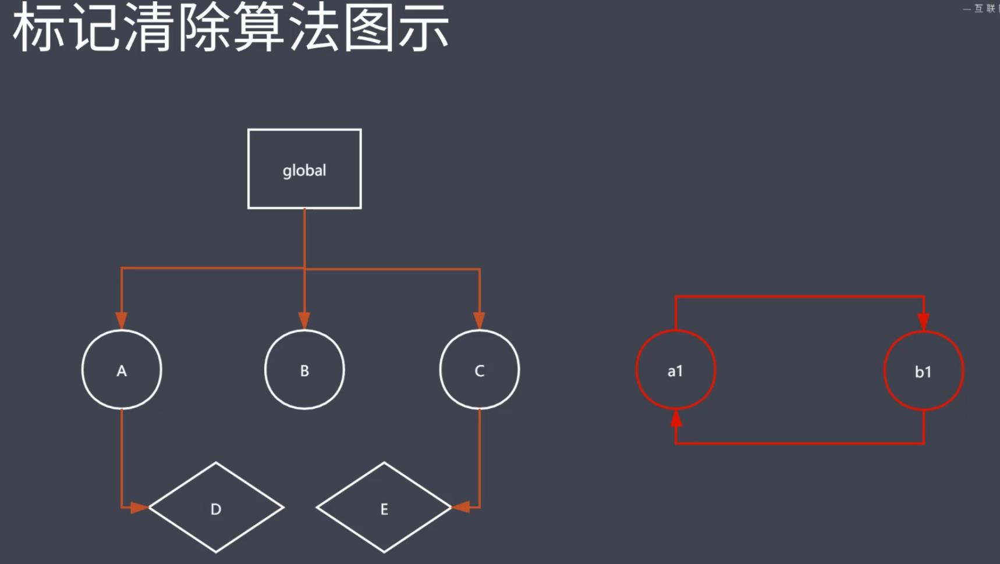
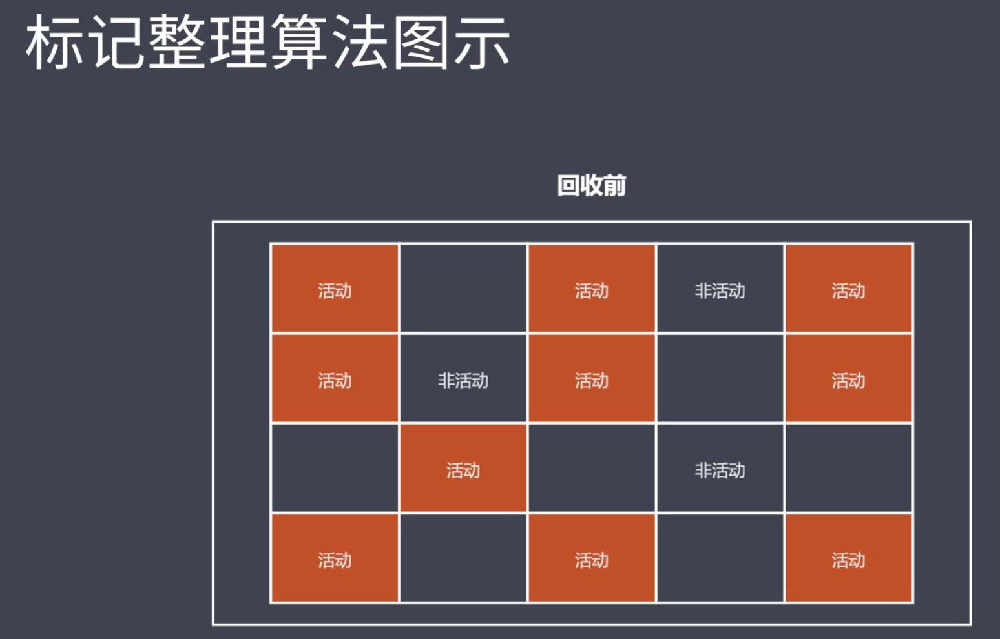
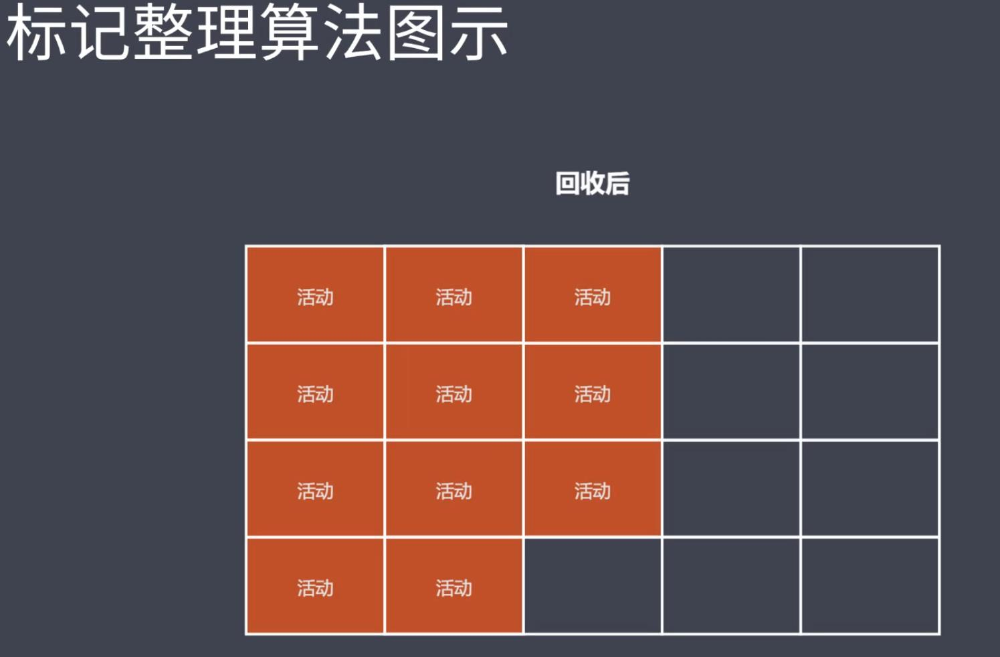
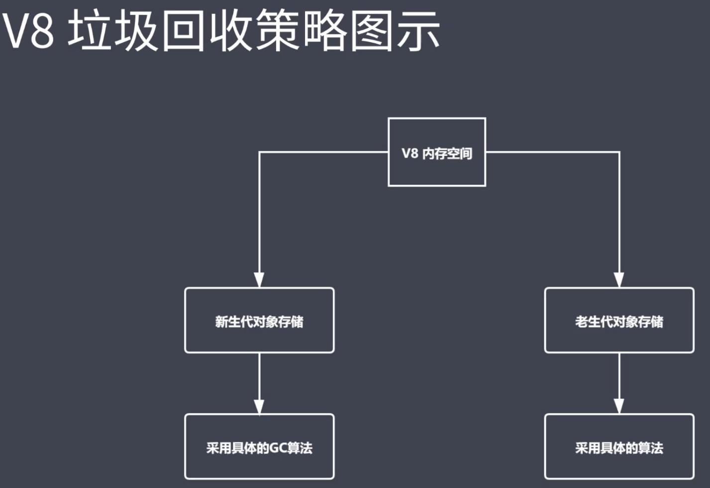
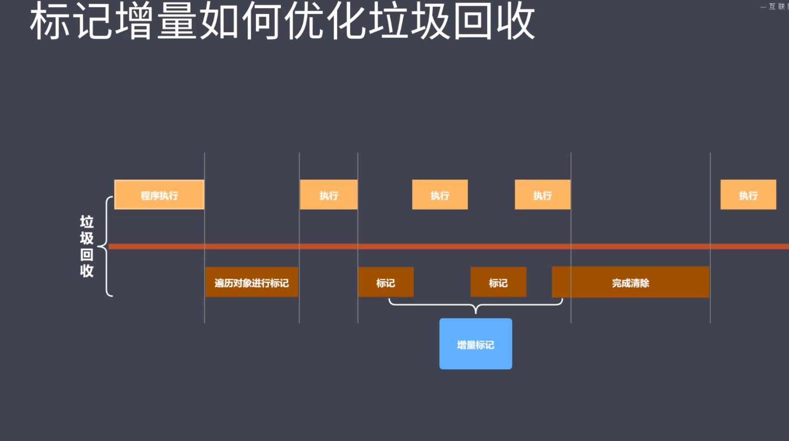

# 模块一
## JavaScript深度剖析
***
  ### ECMAScript新特性
  &ensp;ECMAScript是一种编程规范，而JavaScript是这个规范的一种实现。ES6是在2015年提出的，到了2019年已经是ES10了<br>
  #### **一.块级作用域:**
  &emsp;***1.`var`定义的变量，没有块的概念，可以跨块访问, 不能跨函数访问。***<br>
  &emsp;***2.`let`定义的变量，只能在块作用域里访问，不能跨块访问，也不能跨函数访问。***<br>
  &emsp;***3.`const`用来定义常量，使用时必须初始化(即必须赋值)，只能在块作用域里访问，而且不能修改***<br>
  &emsp;`Let`关键词解决了在不同块之间变量名相同的问题，但是最好不好这么做。<br>
  ```js
  // let 声明的成员只会在所声明的块中生效 -------------------------------------------
if (true) {
  // var foo = 'zce'
  let foo = 'zce';
  console.log(foo);
}

// let 在 for 中同名的情况下正常运行 ---------------------------------------------------

for (var i = 0; i < 3; i++) {
  for (var i = 0; i < 3; i++) {
    console.log(i);
  }
  console.log('内层结束 i = ' + i);
}

for (var i = 0; i < 3; i++) {
  for (let i = 0; i < 3; i++) {
    console.log(i);
  }
  console.log('内层结束 i = ' + i);
}

// let 应用场景：循环绑定事件，获取正确索引 -----------------------------------------------------
//使用var,获取不到6,得到10
 var a = [];
  for(var i = 0;i<10;i++ {
      a[i] = function() {
          console.log(i);
      }
  }>);
  a[6]();
//使用let,获取到6
  var b = [];
  for(let i = 0;i<10;i++ {
      b[i] = function() {
          console.log(i);
      }
  }>);
  b[6]();

// let 修复了变量声明提升现象 --------------------------------------------

console.log(foo);
var foo = 'zce';
//报错
console.log(foo);
let foo = 'zce';
  ```
  #### **二.数组和对象的解构:**
  &emsp;***1.使用`...`解构时只能放到最后面。新的解构算法就是使用方便***<br>
  ```js
  // 数组的解构
const arr = [100, 200, 300]

const [foo, bar, baz] = arr
console.log(foo, bar, baz)

const [, , baz] = arr
console.log(baz)

const [foo, ...rest] = arr
console.log(rest)

const [foo, bar, baz, more] = arr
console.log(more)

const [foo, bar, baz = 123, more = 'default value'] = arr
console.log(bar, more)
  ```
  &emsp;***解构对象时需要使用成员名解构***<br>
  ```js
const obj = { name: 'zce', age: 18 }
const { name } = obj
console.log(name)

const name = 'tom'
const { name: objName } = obj
console.log(objName)

const name = 'tom'
const { name: objName = 'jack' } = obj
console.log(objName)
  ```
  #### **三.模板字符串:**
  ```js
    const name = 'tom'
    // 可以通过 ${} 插入表达式，表达式的执行结果将会输出到对应位置
//     输出结果为hey, tom --- 3 ,
// ---- 0.1613567666415081
    const msg = `hey, ${name} --- ${1 + 2} ,
    ---- ${Math.random()}`
    console.log(msg)；
  ```
  #### **四.箭头函数:**
  &emsp;***箭头函数没有this的机制，不会改变`this`指向***<br>
  ```js
//输出
// fn2undefined
// fn320
// fn120
// fn420
var a = 10;
var obj = {
  a: 20,
  fn() {
    setTimeout(() => {
        console.log("fn1"+this.a);
    }, 0);
  },
  fn2: () => {
    console.log("fn2"+this.a);
  },
  fn3() {
    console.log("fn3"+this.a);
  },
  fn4() {
    setTimeout(() => {
        console.log("fn4"+this.a);
      }, 0);
  }
};
obj.fn();
obj.fn2();
obj.fn3();
obj.fn4();
  ```
  #### **五.Symbol:**
  symbol是一个新类型，它的特点是每一个创建的值都是唯一的，他也可以作为对象的成员，因此我们可以避免对象属性名重复的问题，这样子就可以不用担心由于各种问题导致的属性名重复的问题。其次就是可以通过symbol的唯一性，可以用来实现类的私有数据，而不用通过约定。
  ```js
  // 两个 Symbol 永远不会相等

console.log(
  Symbol() === Symbol()
)

// Symbol 描述文本

console.log(Symbol('foo'))
console.log(Symbol('bar'))
console.log(Symbol('baz'))

// 使用 Symbol 为对象添加用不重复的键

const obj = {}
obj[Symbol()] = '123'
obj[Symbol()] = '456'
console.log(obj)

// 也可以在计算属性名中使用

const obj = {
  [Symbol()]: 123
}
console.log(obj)

// =========================================================

// 案例2：Symbol 模拟实现私有成员

// a.js ======================================

const name = Symbol()
const person = {
  [name]: 'zce',
  say () {
    console.log(this[name])
  }
}
// 只对外暴露 person

  ```
  #### **六.其他:**
  `https://es6.ruanyifeng.com/`
***
  ### Typescript和flow
  #### **一.强类型和弱类型，动态类型和静态类型:**
  &emsp;***1.强类型的特征之一就是实参类型必须要等于形参类型，需要有更强的类型约束，编译时就不会通过***<br>
  &emsp;***2.静态类型的特征之一就是变量声明时变量的类型就是确定的，而动态类型语言则是运行时才会确定，或者说变量没有类型，值有类型***<br>
  #### **二.flow:**
  &emsp;***flow是一个通过增加类型注解的方式，增加代码中的静态类型检查（开发阶段）类型注解会在编译时溢出***<br>
  `https://flow.org/en/docs/install/`
  ```js
  // @flow
function sum (a: number, b: number) {
  return a + b
}
sum(100, 100)

  ```
  #### **三.typescript:**
`typescript`是`javascript`的超集，相当于是以`javascript`为基础，增加了更强大的类型系统和对es规范的支持。实际上就是以面向对象编程的方式使用`Javascript`。当然最后代码还是编译为`Javascript`typescript相对于原生的javascript会更加厚重，增加了很多新的概念，例如泛型编程，枚举，接口等这些常见于各类面向对象语言的概念，而对于小型项目而言，会增加项目开发的成本，如学习成本等。但是它的兼容性非常的好，由于最后都会编译为原生的JavaScript，因此兼容性的问题会更低，而它是一个完整的语言，功能会更加强大，在JavaScript的基础之上增加了更强大的类型系统和对ES规范的支持，这样也会使得开发复杂项目更加的容易，相比起原来的原生开发方式也更能够提高代码的质量。使得开发过程中既能有面向对象语言的严谨，最后运行起来还是和之前的原生JS一样兼容并包。。<br>
`ts用起来更像是面向对象语言，之前做的H5游戏就是使用ts和egret引擎做的，熟悉其他面向对象语言看TS还是看起来很亲切的`<br>
```js
// 类的只读属性

export {} // 确保跟其它示例没有成员冲突

class Person {
  public name: string // = 'init name'
  private age: number
  // 只读成员
  protected readonly gender: boolean
  
  constructor (name: string, age: number) {
    this.name = name
    this.age = age
    this.gender = true
  }

  sayHi (msg: string): void {
    console.log(`I am ${this.name}, ${msg}`)
    console.log(this.age)
  }
}

const tom = new Person('tom', 18)
console.log(tom.name)
// tom.gender = false

```
#### **遇事不决查文档**
`https://www.tslang.cn/docs/home.html`

***
  ### JavaScript性能优化
  JavaScript的内存管理是自动的，当对象没法从根上访问或不再被引用时都是垃圾，需要被回收。内存使用可以通过浏览器自带的performance工具来查看
  #### **一.垃圾回收算法:**
  &emsp;***1.引用计数算法***<br>
  &emsp;引用计数算法的核心思路就是维护一个引用计数器，然后当引用计数器记录的对象的引用为0的时候，那么就可以回收这个内存。引用数值会在引用关系改变的时候进行改变。由于维护了引用计数器，因此会更加耗时<br>
  &emsp;**优点：**<br>
  &emsp;发现垃圾时立刻回收，最大限度的减少由于内存使用过大导致的程序暂停<br>
  &emsp;**缺点：**<br>
  &emsp;无法处理循环引用对象，相对来说时间效率更低<br>
```js
    //循环引用
    const obj1 = {}；
    const obj2 = {};
    obj1.pre = obj2;
    obj2.nxt = obj1;
```
  &emsp;***2.标记清除算法***<br>
  &emsp;标记清除算法的工作流程是分标记和清除两个步骤，先遍历所有对象对进行标记，然后再遍历一遍清除所有不是活动的对象。然后就回收了所有的空间，将他们放到空闲列表中。<br>
  &emsp;**优点：**<br>
  &emsp;相对于引用计数算法，它可以处理循环引用的对象<br>
  &emsp;**缺点：**<br>
  &emsp;但是缺点就是，容易造成碎片化的空间，导致内存的使用并不能非常的有效率。<br>
  #### 标记清除原理：
  
  <br>

  &emsp;***3.标记整理算法***<br>
  &emsp;标记整理算法会将活动空间中的对象进行标记，相比于标记清除算法，多了一个整理内存空间的步骤，然后再释放掉所有非活动对象<br>
  &emsp;**优点：**<br>
  &emsp;相对于引用计数算法，它可以处理循环引用的对象，相对于标记清除算法，他可以避免碎片化的空间<br>
  &emsp;**缺点：**<br>
  &emsp;时间效率更低<br>
  #### 整理前
  
  #### 整理后
  
  <br>

  

  #### **二.V8引擎的垃圾回收:**
  &emsp;V8内部采用的是分代回收的思想，将内存空间分成两个部分，新生代区域和老生代区域，对不同的区域使用不同的算法。总体而言运用了分代回收，空间复制，标记清除，标记整理,标记增量这几种策略<br>
  #### **空间分配方式:**
  小空间(新生代)16m/32m
  大空间(老生代)720m/1.4g<br>
  
  #### 策略图:
  
  <br>

  &emsp;***1.新生代内存区域***<br>
  &emsp;新生代对象指的是存活时间较短的对象，例如局部变量。新生代区域的内存管理主要通过复制算法和标记整理算法来实现，首先会吧内存分为两个相等的空间，分为活动空间（`from`）和空闲空间（`to`），当触发GC时，使用标记整理算法将活动空间中的对象进行标记，然后将再使用复制算法将活动对象复制到空闲空间中，然后再释放掉原来空间中的所有对象，这样就可以获得大量连续的可用空间， 避免了释放内存后的空间碎片化。而这时空闲空间和活动空间则相当于互换了。拷贝过程中，有可能会将新生代转换为老生代对象，会将它们拷贝到老生代储存区。这些转换会发生在`TO`空间使用过多，或者当一轮GC之后还有存活的新生代对象时发生。<br>

  &emsp;***2.老生代内存区域***<br>
  &emsp;在V8引擎中的老生代区域中，会使用到标记清除，标记整理和标记增量算法，我们会首先使用标记清除来释放空间，当老生代区域的空间不足以存放转移过来的新生代对象的时候，则会使用标记整理算法来整理空间。标记增量算法用于优化整个垃圾回收操作，它将我们当前的垃圾回收操作拆分为几个小的步骤，组合起来完成整个垃圾回收操作，让垃圾回收和程序执行交替进行。在程序执行过程中，我们可以执行一段，然后进行一段标记，然后以此类推，当所有标记操作都执行完毕之后，我们再进行一次回收内存的操作，这样拆分了回收的时间，让整个程序流畅度度都上升了。<br>
  #### 标记增量算法原理:
  
  #### **三.js代码优化:**
  &emsp;从编程的角度优化JS的性能，可以使用jspref<br>
  &emsp;***1.慎用全局变量，缓存全局变量***<br>
  ```js
  //使用局部变量有利于性能的提升，大量提升
    var i, str = ''
    for (i = 0; i < 1000; i++) {
    str += i
    }
    //better
    for (let i = 0; i < 1000; i++) {
    let str = ''
    str += i
    }

    //是否缓存全局变量
    //将需要大量使用的变量缓存，可以提高性能
    function getBtn() {
      let oBtn1 = document.getElementById('btn1')
      let oBtn3 = document.getElementById('btn3')
      let oBtn5 = document.getElementById('btn5')
      let oBtn7 = document.getElementById('btn7')
      let oBtn9 = document.getElementById('btn9')
    }
    //将document这个需要大量使用的变量缓存
    function getBtn2() {
      let obj = document
      let oBtn1 = obj.getElementById('btn1')
      let oBtn3 = obj.getElementById('btn3')
      let oBtn5 = obj.getElementById('btn5')
      let oBtn7 = obj.getElementById('btn7')
      let oBtn9 = obj.getElementById('btn9')
    }

  ```
  &emsp;***2.通过原型对象添加附加方法***<br>
  ```js
    //通过原型直接添加方法性能要更好
    var fn1 = function() {
    this.foo = function() {
        console.log(11111)
    }
    }

    let f1 = new fn1()


    var fn2 = function() {}
    fn2.prototype.foo = function() {
    console.log(11111)
    }

    let f2 = new fn2()

  ```
  &emsp;***3.注意闭包使用***<br>
  ```js
    //闭包可能会产生内存泄漏
    function test(func) {
    console.log(func())
    }

    function test2() {
    var name = 'lg'
    return name
    }

    test(function() {
    var name = 'lg'
    return name
    })

    test(test2)

  ```
  &emsp;***4.避免属性访问方法***<br>
  ```js
    //没有必要使用方法访问可以直接访问的属性
    function Person() {
    this.name = 'icoder'
    this.age = 18
    this.getAge = function() {
        return this.age
    }
    }

    const p1 = new Person()
    const a = p1.getAge()


    //直接访问属性性能更好
    function Person() {
    this.name = 'icoder'
    this.age = 18
    }
    const p2 = new Person()
    const b = p2.age

  ```
  &emsp;***5.循环优化***<br>
  ```js
    var arrList = []
    arrList[10000] = 'icoder'
    //for循环使用一个确定的数值，可以提高性能
    for (var i = 0; i < arrList.length; i++) {
    console.log(arrList[i])
    }

    for (var i = arrList.length; i; i--) {
    console.log(arrList[i])
    }
    //不同的FOR循环方式的性能不同
    arrList.forEach(function(item) {
    console.log(item)
    })

    for (var i = arrList.length; i; i--) {
    console.log(arrList[i])
    }

    for (var i in arrList) {
    console.log(arrList[i])
    }

  ```
  &emsp;***6.DOM操作优化***<br>
  ```js
    //节点添加的时候使用文档碎片，然后一次性添加性能更好
    for (var i = 0; i < 10; i++) {
      var oP = document.createElement('p')
      oP.innerHTML = i 
      document.body.appendChild(oP)
    }

    const fragEle = document.createDocumentFragment()
    for (var i = 0; i < 10; i++) {
      var oP = document.createElement('p')
      oP.innerHTML = i 
      fragEle.appendChild(oP)
    }
    //先整合再添加
    document.body.appendChild(fragEle)

    //添加节点的时候，如果有类似的节点，克隆的性能会更好
    for (var i = 0; i < 3; i++) {
      var oP = document.createElement('p')
      oP.innerHTML = i 
      document.body.appendChild(oP)
    }

    var oldP = document.getElementById('box1')
    for (var i = 0; i < 3; i++) {
      var newP = oldP.cloneNode(false)
      newP.innerHTML = i 
      document.body.appendChild(newP)
    }

  ```
  &emsp;***7.直接量替换newObj***<br>
  ```js
    //直接量赋值要比使用new之后操作obj的赋值更快，
    var a = [1, 2, 3]

    var a1 = new Array(3)
    a1[0] = 1
    a1[1] = 2
    a1[2] = 3

  ```
