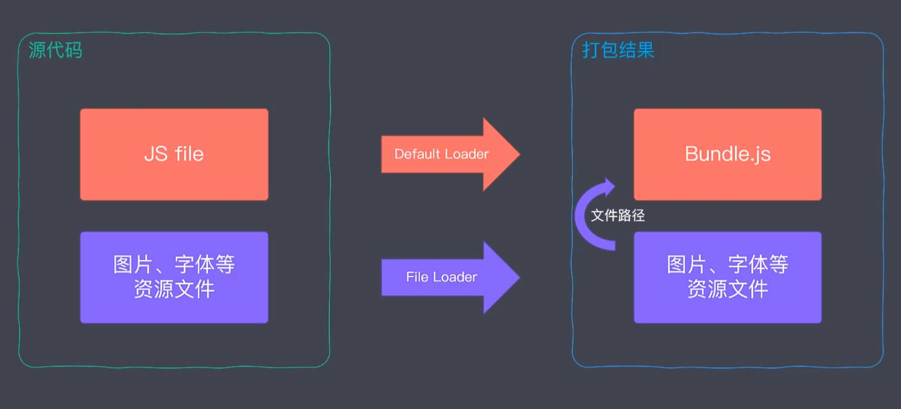
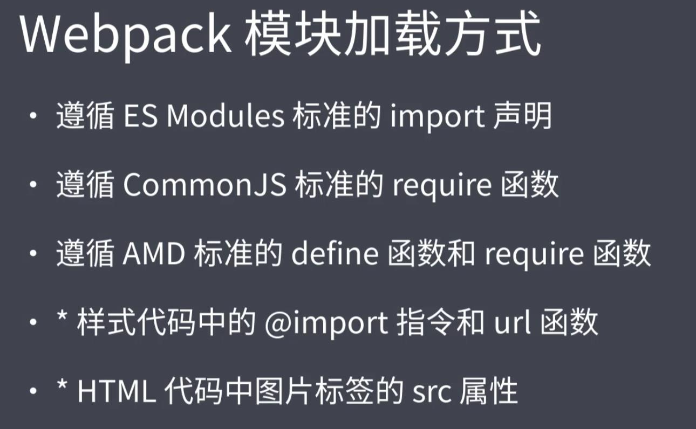
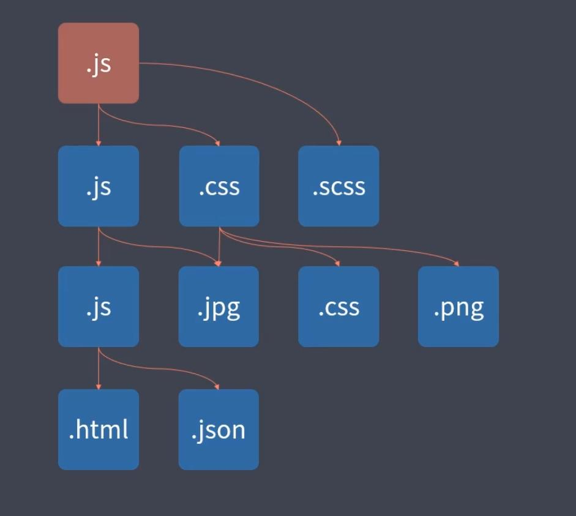
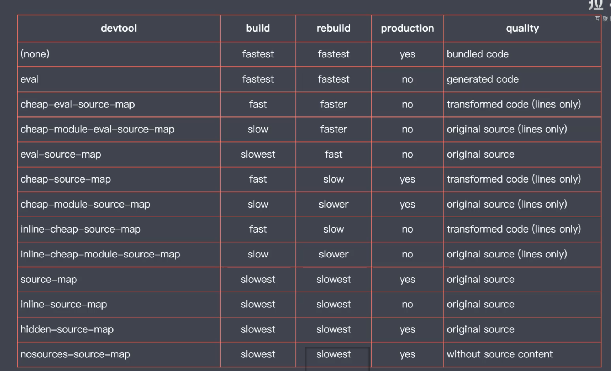
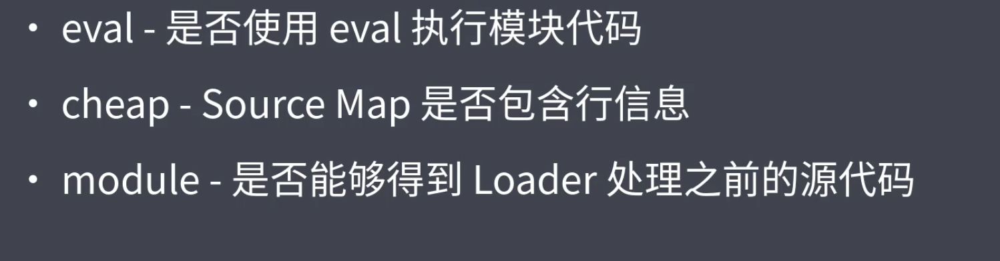

# 模块二
##  模块化开发与规范化标准
***
### 模块化开发 
&emsp;模块化的思想是将代码以功能来分为各种不同的模块的一种管理项目代码的一种思想。
#### **模块化标准规范**
&emsp;CommonJS规范（nodejs的规范，同步模式加载规范）<br>
&emsp; ***1.一个文件就是一个模块***<br>
&emsp; ***2.每个模块都有单独的作用域***<br>
&emsp; ***3.通过module.exports导出模块***<br>
&emsp; ***4.通过require函数载入模块***<br>
&emsp;RequireJS，AMD规范（请求规范）<br>
&emsp;ESmodules规范（客户端部分规范）<br>
#### **ESmodules**
&emsp;ESmodules特点<br>
&emsp; ***1.自动使用严格模式***<br>
&emsp; ***2.每个模块都是单独运行在私有作用域中***<br>
&emsp; ***3.通过CORS请求外部模块***<br>
&emsp; ***4.script标签会延迟执行脚本***<br>
&emsp; ***5.导入导出并不是字面量***<br>
&emsp; ***6.导入导出的地址，而外部引用的是只读***<br>
&emsp;ESmodules其他注意事项<br>
&emsp; ***1.import使用完整的文件名，url等，`import*as a from`, `import from"xxx"`***<br>
&emsp; ***2.动态导入模块时可以使用promise方式，`import（）.then`***<br>
&emsp; ***3.使用`polyfill方式`（使用过）***<br>
&emsp; ***4.ESmodules中可以导入commonjs的模块，反之则不行***<br>
&emsp; ***5.commonjs始终只导出一个默认成员***<br>
### Webpack
&emsp; WebPack可以将零散的模块代码打包到一起，有兼容性的可以通过模块加载器（Loader）进行加载，还可以进行分包打包，可以支持模块化的方式加载资源<br>
&emsp; ***1.WebPack打包模式有`development`,`production`,`none`三个不同的模式***<br>
&emsp; ***2.WebPack打包整体生成了一个立即执行函数，调用时传入一个数组，这个数组当中的每一项都是一个参数相同的函数，这些函数都是一个个独立的模块，这些函数就形成了我们模块的一个个的私有作用域，可执行函数最后会调用一个require模块的函数，这个函数会读取上面提到的数组的部分然后判断是否加载，如果没有加载则会加载，加载过程中会加上了标签***<br>
&emsp; ***3.对于非JS的资源文件等，可以通过不同的`loader`进行加载,配置的loader是从后往前执行的，一般而言，通过js文件作为打包入口，然后再用`import`的方式进行导入是很好的行为***<br>
```js
  module: {
    rules: [
      {
        test: /.css$/,
        use: [
          'style-loader',
          'css-loader'
        ]
      }
    ]
  }
```
&emsp; ***4.Webpack鼓励通过代码在代码中引入需要的资源***<br>
&emsp; ***5.`fileLoader`可以用来加载非代码的字体，图片等资源文件这些资源会作为路径保存在打包结果中，一般适用于大文件打包***<br>

&emsp; ***6.资源文件哈可以通`dataURL`通过`urlloader`来进行打包，`dataURL`通过URL直接表示文件，这样就不会发送请求就可以表示一个文件，如果是无法直接表示的，就可以通过base64编码转化为代码，这种打包方式会吧读取出来的文件写入到打包到的结果里面，一般适用于小资源打包，这样整体会更快也，减少了请求***<br>
```js
      {
        test: /.png$/,
        use: {
          loader: 'url-loader',
          options: {
            limit: 10 * 1024 // 10 KB
          }
        }
      }
```
&emsp; ***7.常用的loader的作用包括编译转换代码，文件操作，代码规范等***<br>
&emsp; ***8.可以通过require和import两种方式去加载模块***<br>

#### WebPack核心工作原理
&emsp; ***WebPack会通过入口文件的代码，解析每个导入文件的依赖模块，随后形成一个依赖树，然后通过递归遍历整个依赖树，通过配置的规则，使用不同的loader对不同的模块进行加载***<br>

&emsp; ***WebPack自定义loader***<br>
```js
//使用的解析工具
const marked = require('marked')
module.exports = source => {
  //source是传入的模块
  const html = marked(source)
  //loader返回的结果必须是js代码，因此如果结果不是，就要返回内容给另外一个loader获取一个新的结果
  // 返回 html 字符串交给下一个 loader 处理
  return html
}

//config
    rules: [
      {
        test: /.md$/,
        use: [
          'html-loader',
          './markdown-loader'
        ]
      }
    ]

```
#### WebPack插件机制
&emsp;插件机制是为了增强Webpack整体的自动化工作的能力，比如清除目录，拷贝文件，压缩代码等等，这些在上一课当中已经体会过了<br>
&emsp;使用html-webpack-plugins可以自动化创建HTML并引用<br>
```js
  plugins: [
    new CleanWebpackPlugin(),
    // 用于生成 index.html
    new HtmlWebpackPlugin({
      title: 'Webpack Plugin Sample',
      meta: {
        viewport: 'width=device-width'
      },
      template: './src/index.html'
    }),
    // 用于生成 about.html
    new HtmlWebpackPlugin({
      filename: 'about.html'
    })
  ]
```
&emsp;开发一个自定义插件，Webpack埋下了大量的钩子，可以随时扩展。钩子可以在官网查<br>
```js
class MyPlugin {
  apply (compiler) {
    console.log('MyPlugin 启动')

    compiler.hooks.emit.tap('MyPlugin', compilation => {
      // compilation => 可以理解为此次打包的上下文
      for (const name in compilation.assets) {
        // console.log(name)
        // console.log(compilation.assets[name].source())
        if (name.endsWith('.js')) {
          const contents = compilation.assets[name].source()
          const withoutComments = contents.replace(/\/\*\*+\*\//g, '')
          compilation.assets[name] = {
            source: () => withoutComments,
            size: () => withoutComments.length
          }
        }
      }
    })
  }
}

```
#### 杂七杂八
&emsp; ***`webpack dev server`自带`--watch`模式，还可以设置proxy（用过）***<br>
&emsp; ***SourceMap用来映射转换后的代码和源代码的关系，用于开发时调试，通过sourcemap就可以通过编译后的代码反向转换前的代码，生产环境下有一些工具可以不暴露源代码定位位置如cheap-module-source-map方式定位源代码位置***<br>
&emsp; ***Webpack有大量的SourceMap支持方式，还有很多devtool模式，在`devtool:`这个属性中配置***<br>

&emsp; ***devtool模式之间也有区别***<br>

&emsp; ***一些推荐：1.开发模式下 `cheap-moudule-eval-source-map`2.生产 none 3.***<br>
&emsp; ***Webpack热更新如果使用代码接受更新事件，页面不会更新***<br>
&emsp; ***可以使用defineplugin的方式动态注入某些插件，但是传入值需要是代码片段***<br>
```js
  plugins: [
    new webpack.DefinePlugin({
      // 值要求的是一个代码片段
      API_BASE_URL: JSON.stringify('https://api.example.com')
    })
  ]

```
&emsp; ***TreeShaking的作用是将未引用的代码移除，是Webpack生产模式的一个特性，他是多个功能一起实现的结果。使用配置可以将模块合并，利于压缩。`concatenateModules`属性***<br>
```js
module.exports = {
  mode: 'none',
  entry: './src/index.js',
  output: {
    filename: 'bundle.js'
  },
  optimization: {
    // 模块只导出被使用的成员
    usedExports: true,
    // 尽可能合并每一个模块到一个函数中
    concatenateModules: true,
    // 压缩输出结果
    // minimize: true
  }
}

```
&emsp; ***sideEffect是一个特殊的标记，没有副作用的代码会被忽视***<br>
&emsp; ***可以通过不同的规则来分割代码，有两种方式，一是通过不同的入口，二是通过动态导入模块***<br>
```js
//多入口
//常用于多页面应用，将不同页面为入口，公共代码为入口
const { CleanWebpackPlugin } = require('clean-webpack-plugin')
const HtmlWebpackPlugin = require('html-webpack-plugin')

module.exports = {
  mode: 'none',
  entry: {
    index: './src/index.js',
    album: './src/album.js'
  },
  output: {
    filename: '[name].bundle.js'
  },
  module: {
    rules: [
      {
        test: /\.css$/,
        use: [
          'style-loader',
          'css-loader'
        ]
      }
    ]
  },
  plugins: [
    new CleanWebpackPlugin(),
    new HtmlWebpackPlugin({
      title: 'Multi Entry',
      template: './src/index.html',
      filename: 'index.html',
      chunks: ['index']
    }),
    new HtmlWebpackPlugin({
      title: 'Multi Entry',
      template: './src/album.html',
      filename: 'album.html',
      chunks: ['album']
    })
  ]
}

```
&emsp; ***提取公共模块***<br>
```js
  optimization: {
    splitChunks: {
      // 自动提取所有公共模块到单独 bundle
      chunks: 'all'
    }
  },

```
&emsp; ***动态加载模块，指需要时才加载模块，也会分包***<br>
```js
  if (hash === '#posts') {
    // mainElement.appendChild(posts())
    import(/* webpackChunkName: 'components' */'./posts/posts').then(({ default: posts }) => {
      mainElement.appendChild(posts())
    })
  } else if (hash === '#album') {
    // mainElement.appendChild(album())
    import(/* webpackChunkName: 'components' */'./album/album').then(({ default: album }) => {
      mainElement.appendChild(album())
    })
  }

```
&emsp; ***使用特殊注释可以为输出命名***<br>
&emsp; ***可以通过不同的参数输出不同的哈希值文件名（有啥用啊）***<br>
### 其他打包工具
#### ROLLUP
&emsp;Rollup会将代码块按照引用的顺序拼接成一个打包好的代码文件(可读)，不会添加多余的代码，并且会默认开启TreeShaking，但是加载第三方比较复杂，模块最后都打包为议题，无法形成HMR，并且依赖AMD库来拆分代码。可以用于开发类库而不是整个大的应用程序
```js
//config.js
export default [
  {
    input: 'src/index.js',
    output: {
      file: 'dist/bundle.iife.js',
      format: 'iife'
    }
  },
  {
    input: 'src/index.js',
    output: {
      file: 'dist/bundle.cjs.js',
      format: 'cjs'
    }
  },
  {
    input: 'src/index.js',
    output: {
      file: 'dist/bundle.esm.js',
      format: 'esm'
    }
  },
  {
    input: 'src/index.js',
    output: {
      file: 'dist/bundle.amd.js',
      format: 'amd'
    }
  },
  {
    input: 'src/index.js',
    output: {
      file: 'dist/bundle.system.js',
      format: 'system'
    }
  },
  {
    input: 'src/index.js',
    output: {
      file: 'dist/bundle.umd.js',
      format: 'umd'
    }
  }
]

```
#### parcel
&emsp;parcel是一个高度封装的高速多进程的打包工具。2017年发布（如果发展得当，我觉得这种高度简化的打包工具会占据大半江山）
### 代码规范化
#### **ESLint老朋友**
此处应该直接贴官网链接`https://eslint.bootcss.com/`