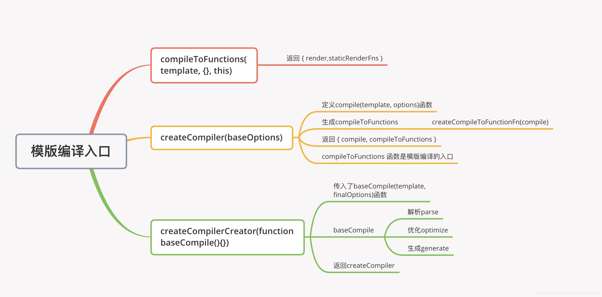

# Vue源码分析
## 五图流
### 模板编译的入口

模板编译为render函数，是会判断是否有`render`选项，如果没有，则会获取`template`选项，如果`template`也没有，会把`el`中的内容作为模板，通过`compileToFunctions()`方法将模板编译为`render`函数，所以运行时版本是不包括模板编译功能的
### 首次编译的过程

&ensp;在首次渲染之前,首先进行Vue初始化,初始化实例成员和静态成员
当初始化结束之后,要调用Vue的构造函数new Vue(),在构造函数中调用了_init()方法,这个方法相当于我们整个Vue的入口 
&ensp;在_init方法中,最终调用了$mount,一共有两个$mount,第一个定义在entry-runtime-with-compiler.js文件中,也就是我们的入口文件$mount,这个$mount()的核心作用是帮我们把模板编译成render函数，但它首先会判断一下当前是否传入了render选项，如果没有传入的话，它会去获取我们的template选项，如果template选项也没有的话，他会把el中的内容作为我们的模板，然后把模板编译成render函数，它是通过compileToFunctions()函数，帮我们把模板编译成render函数的,当把render函数编译好之后，它会把render函数存在我们的options.render中。 
&ensp;接着会调用`src/platforms/web/runtime/index.js`文件中的$mount方法,在这个中首先会重新获取el，因为如果是运行时版本的话，是不会走`entry-runtime-with-compiler.js`这个入口中获取el，所以如果是运行时版本的话，我们会在runtime/index.js的$mount()中重新获取el。 
&ensp;接下来调用`mountComponent()`,这个方法在`src/core/instance/lifecycle.js`中定义的，在`mountComponent()`中，首先会判断render选项，如果没有render选项，但是我们传入了模板，并且当前是开发环境的话会发送一个警告，目的是如果我们当前使用运行时版本的Vue,而且我们没有传入render,但是传入了模版,告诉我们运行时版本不支持编译器。接下来会触发beforeMount这个生命周期中的钩子函数，也就是开始挂载之前。 
&ensp;然后定义了`updateComponent()`，在这个函数中，调用vm._render和vm._update，vm._render的作用是生成虚拟DOM，vm._update的作用是将虚拟DOM转换成真实DOM，并且挂载到页面上
&ensp;创建Watcher对象，在创建Watcher时，传递了updateComponent这个函数，这个函数最终是在Watcher内部调用的。在Watcher内部会用了get方法，当Watcher创建完成之后,会触发生命周期中的mounted钩子函数,在get方法中，会调用updateComponent() 
&ensp;挂载结束，最终返回Vue实例。
### 模板的编译过程

&ensp;模板编译的主要目的是将模板template转化为渲染函数render,编译模板的过程使用了AST抽象语法树，使用对象的形式描述树形的代码结构，模板编译是将模板字符串首先转化为AST对象，然后优化AST对象，优化的过程是在标记静态根节点，然后吧优化号的AST对象转化为字符串形式的代码，最终把字符串形式代码通过newFunction转化为匿名函数，这个匿名函数就是最终生成的函数render函数，模板编译就是啊模板字符串转化为渲染函数。
### 数据响应式

&ensp;数据响应式是指，当数据发生变化自动更新视图，不需要手动操作dom，在这个过程中，Vue做的操作为
1. initState
&ensp;整个响应式是从init方法中开始的，在init方法中，调用initState方法初始化状态，在initState方法中调用initData（），将data属性注入到vue实例上，并且调用observe（）将其转化为响应式对象，observe是响应式的入口
2. observe
&ensp;observer的意思是观测者，`observe（value）`函数位于`src/core/observer/index.js`，首先判断value是否是对象，如果不是对象直接返回，判断value对象是否有`__ob__`,如果有证明value已经做过响应化处理，是响应式数据，则直接返回，如果没有，则在第三步创建observer对象，并将其返回。然后是`Observe()`函数，位于`src/core/observer/index.js`,给value对象定义不可枚举的`__ob__`属性，记录当前的`observer`对象，进行数组的响应化处理，设置数组中的方法push、pop、sort等，这些方法会改变原数组，所以当这些方法被调用的时候，会发送通知，找到`observe`对象中的`dep`，调用`dep.notify()`方法，然后调用数组中的每一个成员，对其进行响应化处理，如果成员是对象，也会将转化为响应式对象，如果value是对象的话，会调用`walk()`，遍历对象中的每一个成员，调用`defineReactive()`
3. defineReactive设置响应式
&ensp;defineReactive函数位于`src/core/observer/index.js`,为每一个属性创建dep对象，如果当前属性是对象，递归调用observe()
getter:为每一个属性收集依赖，如果当前属性是对象，也为对象的每一个属性收集依赖，最终返回属性值。
setter:保存新值，如果新值是对象，则调用observe,派发更新（发送通知），调用dep.notify()
4. 依赖收集
&ensp;在watcher对象的get方法中调用pushTarget，会把当前的watcher记录Dep.target属性，访问的data成员的时候收集依赖，访问值的时候会调用defineReactive的getter中收集依赖，把属性对应的watcher对象添加到dep的subs数组中，如果属性是对象，则给childOb收集依赖，目的是子对象添加和删除成员时发送通知。
5. Watcher
&ensp;当数据发生变化时，会调用`dep.notify()`，调用watcher对象的`update()`方法，在update方法中会调用`queueWatcher()`，方法中会判断watcher是否被处理，如果没有，则将其添加到queue队列中，并调用`flushSchedulerQueue()`刷新任务队列，在`flushSchedulerQueue`中，会触发`beforeUpdate`钩子函数，然后调用`watcher.run（）`，然后清空上一次的依赖，触发actived钩子函数，触发update钩子函数。
### 整体过程分析

